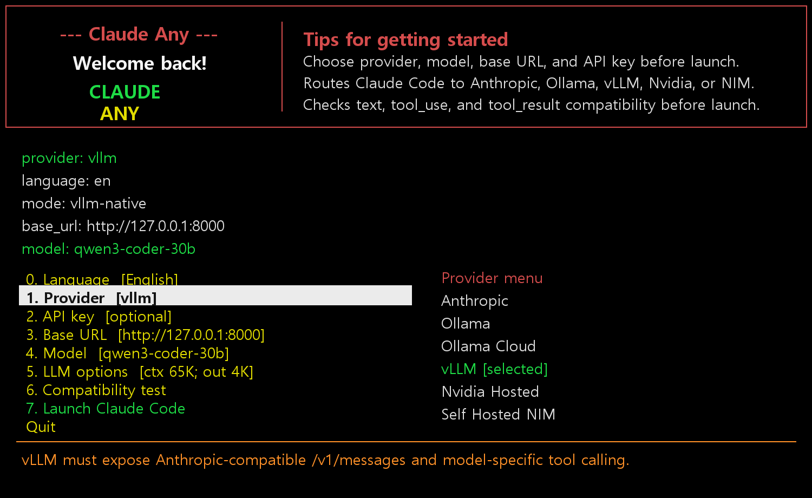
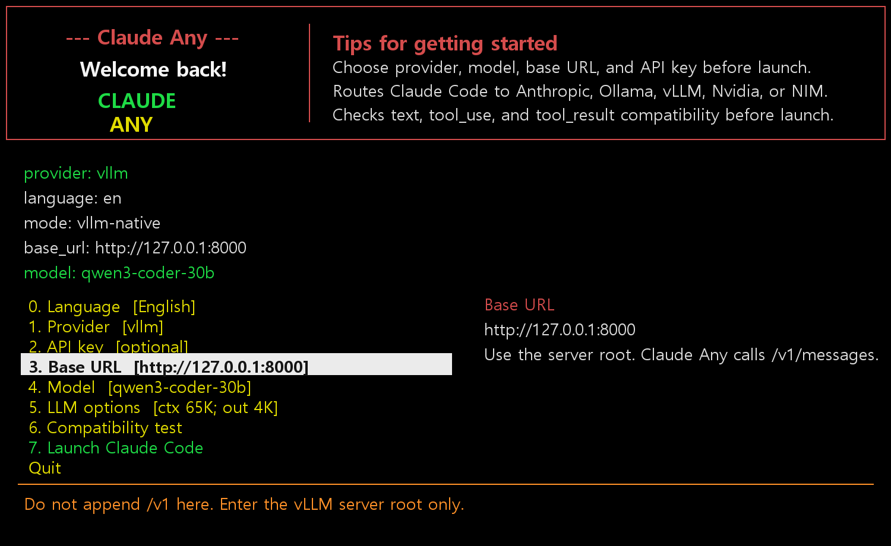
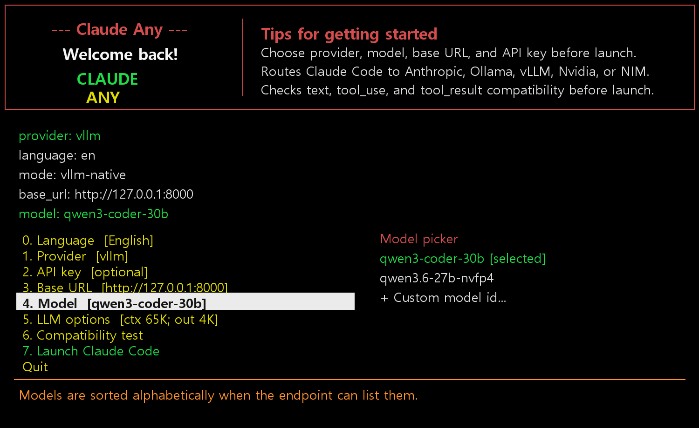
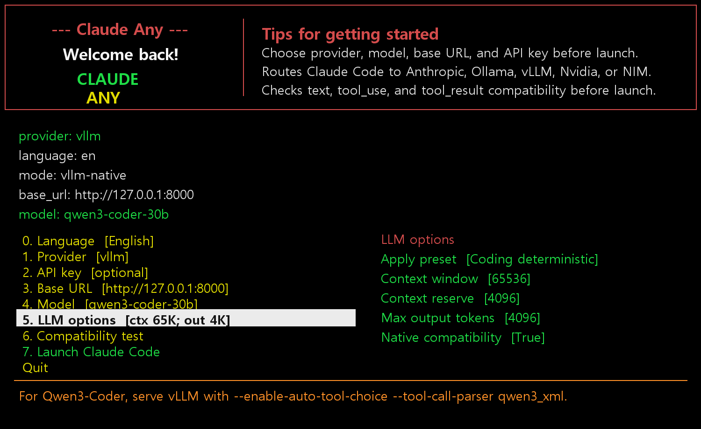
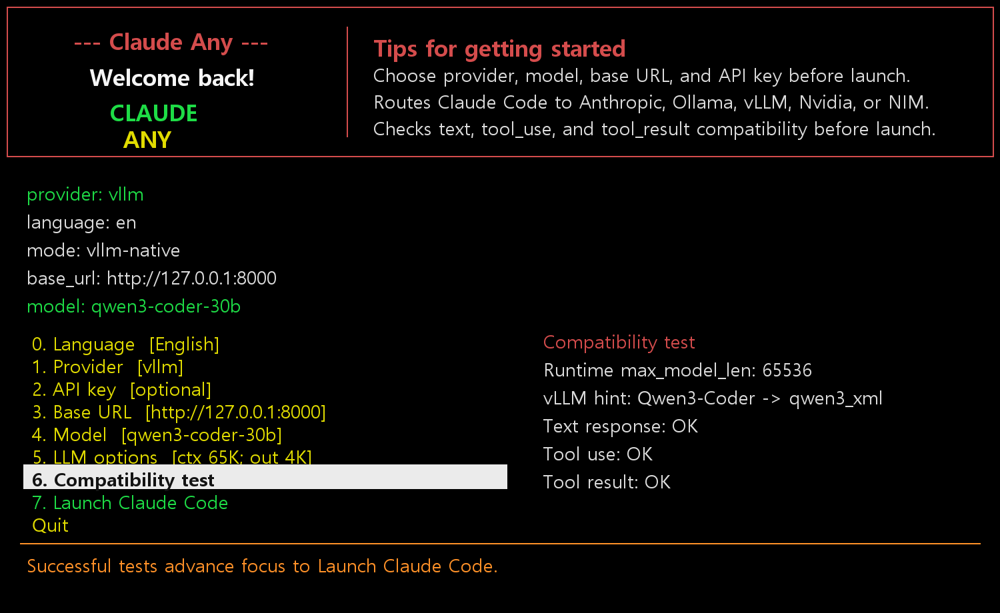

# Claude Any

<p align="center">
  
</p>


| English | [한국어](docs/README.ko.md) | [日本語](docs/README.ja.md) | [中文](docs/README.zh.md) |
| --- | --- | --- | --- |

[](https://www.npmjs.com/package/@oneciel-ai/claude-any)
[](https://www.npmjs.com/package/@oneciel-ai/claude-any)
[](LICENSE)

> ## 🚀 Use the full Claude Code experience with free or low-cost LLMs
>
> - **Free** — [NVIDIA hosted NIM](https://build.nvidia.com/) (qwen3-coder-480b, gpt-oss, and friends) through the API Catalog.
> - **Low-cost** — [Ollama Cloud](https://ollama.com/cloud) for GLM, Qwen, DeepSeek, and other open-weight models at a fraction of frontier-model pricing.
> - **Free + local** — [Ollama](https://ollama.com/) or [vLLM](https://github.com/vllm-project/vllm) on your own GPU, fully offline.
> - **Plan Mode + Advisor ready** — Claude Any preserves Claude Code Plan Mode on non-Anthropic providers and adds an optional long-context Advisor model for review.
> - **Smooth free-model pacing** — Claude Code spends time reading files and running tools, and Claude Any uses that natural gap for RPM pacing so NVIDIA hosted free models feel usable even with strict per-minute limits.
>
> Provider, model, base URL, API key, streaming behavior, and LLM options are all selected from a console menu **before** Claude Code starts. Claude Code itself runs untouched with all of its native tooling, slash commands, and workflows.

## Today's Top 3 Benefits

1. **Plan Mode works on non-Anthropic models** — Claude Any keeps Claude Code's Plan Mode usable even when the upstream provider is NVIDIA hosted, Ollama Cloud, local Ollama, vLLM, or NIM.
2. **Advisor review with a bigger model** — pick a long-context Advisor Model at launch, then use `/advisor` inside Claude Code to review the current task, blockers, and next concrete action.
3. **Free-model RPM limits feel smoother** — router-side RPM pacing uses the natural time spent reading files and running tools, so NVIDIA hosted free models can stay within per-minute limits with less visible waiting.

### Demo


NVIDIA hosted NIM (deepseek-4-flash) driving Claude Code through the claude-any router. &nbsp;[full mp4 ⤓](https://github.com/OneCielAI/claude-any/raw/main/demo/claude-any-nvidia-nim.mp4)


Ollama Cloud (glm-5.1) streamed through the claude-any router with SSE word-boundary chunking enabled. &nbsp;[full mp4 ⤓](https://github.com/OneCielAI/claude-any/raw/main/demo/claude-any-ollama-cloud.mp4)

---

Claude Any is a provider selector and compatibility launcher for Claude Code.
It lets you choose Anthropic, Ollama, Ollama Cloud, vLLM, NVIDIA hosted models,
or self-hosted NIM before Claude Code starts, then passes normal Claude Code
arguments through unchanged.

Credits: One Ciel LLC

Current version: `0.1.39`

## Why This Exists

Claude Any started from a practical need: even on the highest Claude Code plan,
long sessions can run out of available tokens or become blocked while waiting
for the next quota window. The goal is not to replace Claude Code, but to keep
work moving. Slower but usable providers such as NVIDIA NIM, Ollama Cloud,
vLLM, and local Ollama can act as hybrid third-party agents for summaries,
research, journaling, simple coding tasks, and delegated background work.

Another design goal is to keep as much of Claude Code's native experience as
possible. When a provider exposes an Anthropic-compatible endpoint, Claude Any
prefers that path so Claude Code tooling, permissions, model selection, and
workflow behavior remain close to the original. For capabilities that remote
providers cannot supply directly, such as web search, Claude Any adds separate
MCP-based tooling.

The pre-launch menu is console-first. Provider, model, base URL, API key, and
options are meant to be easy to review and change before Claude Code starts,
including over SSH.

macOS has not been fully tested by the maintainer yet, but Claude Any uses
portable Python and shell wrappers. If you hit a macOS issue, please report it.

- D. Yun

## Install

[](https://www.npmjs.com/package/@oneciel-ai/claude-any)
[](https://www.npmjs.com/package/@oneciel-ai/claude-any)

Requirements:

- Python 3.10+
- Claude Code installed and available as `claude`
- Node/npm (used for the install shim and optional MCP web tooling)

**Install from the npm registry (recommended):**

```sh
npm install -g @oneciel-ai/claude-any
```

```sh
claude-any
```

## Run Claude Code Headlessly

Use headless mode when a script, SSH session, CI job, or parent agent needs to
launch Claude Code directly without opening the pre-launch menu. `claude-any`
consumes `--ca-*` options, starts the required local router, and passes the
remaining arguments to Claude Code.

```sh
claude-any --ca-provider nvidia-hosted --ca-model z-ai/glm-4.7
```

```sh
claude-any --ca-provider ollama-cloud --ca-model glm-5.1
```

```sh
claude-any --ca-provider ollama --ca-base-url http://127.0.0.1:11434 --ca-model qwen3-coder
```

Run one non-interactive Claude Code prompt:

```sh
claude-any --ca-provider nvidia-hosted --ca-model z-ai/glm-4.7 --ca-no-update-check -p "Reply with OK only." --output-format text
```

Use the saved provider/model and only skip the menu:

```sh
CLAUDE_ANY_SKIP_MENU=1 claude-any -p "Summarize this repository." --output-format text
```

Configure every launch option with flags:

```sh
claude-any --ca-provider nvidia-hosted --ca-base-url https://integrate.api.nvidia.com/v1 --ca-model z-ai/glm-4.7 --ca-advisor-model deepseek-ai/deepseek-v4-pro --ca-api-key-env NVIDIA_API_KEY --ca-max-output-tokens 4096 --ca-context-window 65536 --ca-request-timeout-ms 300000 --ca-rate-limit-rpm 40 --ca-rate-limit-status on --ca-no-update-check -p "Reply with OK only." --output-format text
```

Or put the same values in environment variables:

```sh
export CLAUDE_ANY_SKIP_MENU=1
export CLAUDE_ANY_PROVIDER=nvidia-hosted
export CLAUDE_ANY_BASE_URL=https://integrate.api.nvidia.com/v1
export CLAUDE_ANY_MODEL=z-ai/glm-4.7
export CLAUDE_ANY_ADVISOR_MODEL=deepseek-ai/deepseek-v4-pro
export CLAUDE_ANY_API_KEY_ENV=NVIDIA_API_KEY
export CLAUDE_ANY_MAX_OUTPUT_TOKENS=4096
export CLAUDE_ANY_CONTEXT_WINDOW=65536
export CLAUDE_ANY_REQUEST_TIMEOUT_MS=300000
export CLAUDE_ANY_RATE_LIMIT_RPM=40
export CLAUDE_ANY_RATE_LIMIT_STATUS=on
claude-any -p "Reply with OK only." --output-format text
```

For `.env` driven runs, save the same `CLAUDE_ANY_*` values in a file and pass
it explicitly:

```sh
claude-any --ca-env-file .env.claude-any -p "Reply with OK only." --output-format text
```

Override order is deterministic: saved user choices from the menu are the
baseline, OS environment variables override them, `--ca-env-file` values
override the OS environment, CLI `--ca-*` parameters override the env file, and
`--ca-menu` lets the final interactive menu choice override everything.

Headless coverage checklist: provider, base URL, model, Advisor model, API key
or API-key environment variable, max output, context window, request timeout,
RPM limit, RPM status display, streaming, web search, web fetch, Claude skills,
update check, language, Ollama context/options, and normal Claude Code
passthrough arguments are all configurable without opening the menu. API keys
can be passed directly with `--ca-api-key`, but `--ca-api-key-env` is safer for
scripts because the secret does not appear in shell history.

More examples are in [Headless Examples](#headless-examples) and
[the full manual](docs/manual.md#headless-usage).

**Upgrade:**

```sh
npm update -g @oneciel-ai/claude-any
```

```sh
claude-any version
```

**Uninstall:**

```sh
npm uninstall -g @oneciel-ai/claude-any
```

### Alternative install paths

Install directly from the GitHub repository (useful for testing unreleased
commits between npm publishes):

```sh
npm install -g https://github.com/OneCielAI/claude-any.git
```

```sh
claude-any
```

POSIX source install:

```sh
git clone https://github.com/OneCielAI/claude-any.git
```

```sh
cd claude-any
```

```sh
./install.sh
```

```sh
claude-any
```

Windows PowerShell source install:

```powershell
git clone https://github.com/OneCielAI/claude-any.git
```

```powershell
cd claude-any
```

```powershell
.\install.ps1
```

```powershell
claude-any
```

### Releasing (maintainers)

The npm registry version is published automatically by the
[`Publish to npm`](.github/workflows/npm-publish.yml) workflow when a new
GitHub Release is published. The workflow needs an `NPM_TOKEN` repository
secret containing a granular access token for `@oneciel-ai/claude-any` with
*Bypass 2FA for publishing* enabled.

Release flow:

1. Bump `version` in `package.json` and `VERSION` in `claude_any.py`.
2. Add a Changelog entry.
3. `git tag -a vX.Y.Z -m "..." && git push origin vX.Y.Z`.
4. `gh release create vX.Y.Z --title "..." --notes "..."` — this triggers
   the publish workflow.




## Demo


The demo sequence now shows provider selection, Base URL entry, model selection,
LLM options, and the compatibility test. The compatibility test checks a plain
text response, a required `tool_use`, and a `tool_result` follow-up before the
launcher recommends starting Claude Code.

Additional current screenshots:

| Provider | Base URL | Model | LLM options | Compatibility |
| --- | --- | --- | --- | --- |
|  |  |  |  |  |

See the [full manual](docs/manual.md) for provider setup, headless flags, and
troubleshooting. A downloadable demo video is available at
[docs/assets/claude-any-demo.mp4](docs/assets/claude-any-demo.mp4).

## Development Story

Claude Any was built through real integration tests: provider switching, model
discovery, API-key entry, compatibility tests, web-search tooling, timeout
handling, and native Claude Code behavior. The main lesson was that
Anthropic-compatible Messages endpoints are the cleanest integration path when a
provider supports them. Ollama, vLLM, and NIM can expose Anthropic-compatible
routes that preserve more of Claude Code's tooling model than a generic
OpenAI-compatible chat route.

Local inference was also tested with Qwen 3.6 27B Q4 through Ollama and vLLM on
RTX 5090 and MSI GB10-class hardware. It worked, but the speed should not be
judged against native Claude Code or Codex. In practice, some hosted/cloud
choices such as NVIDIA NIM and Ollama Cloud felt more useful for this hybrid
workflow than expected.

OpenAI-compatible endpoints were deliberately kept out of the primary path for
Claude Code use. In testing, tool-call translation through generic OpenAI chat
compatibility was more brittle around tool parameters, tool results, repeated
calls, retries, and model selection.

The most recent vLLM finding is that server-side tool-call parsing must match
the model family. For Claude Code, a vLLM server can be reachable and still fail
if `--tool-call-parser` is wrong. In particular, Qwen3-Coder should be served
with `--enable-auto-tool-choice --tool-call-parser qwen3_xml`; Hermes is for
Hermes-style models and some older Qwen tool templates. Claude Any now surfaces
this in the compatibility test instead of treating a simple text response as
enough.

## Recommended Uses

Claude Any is most useful where speed is less important than keeping background
work moving. Good fits include Docker host maintenance, Windows or Linux system
administration, cleanup scripts for unused files, periodic security checklists,
log review, Windows Event Log review, intrusion-attempt triage, and report
drafting.

It is not a replacement for dedicated security products, but it can help
administrators turn routine checks into repeatable scripts and readable reports.
It is useful for summarizing possible virus, ransomware, brute-force, or
remote-access intrusion attempts. In that sense, Claude Any can help you build a
free or low-cost system security watcher for routine checks, alerts, and
human-readable summaries.

For example, it can help turn requests such as "install PostgreSQL in a Docker
container" or "analyze today's Docker logs and email me a report" into concrete
commands, scripts, scheduled jobs, and summaries.

A practical pattern is tiered supervision: use smaller or cheaper models to
watch logs and detect possible issues, use a larger model to review findings,
write policy, and plan the response, then let smaller models execute routine
steps under that larger model's supervision.

## Features

- Pre-launch provider picker with English, Korean, Japanese, and Chinese UI.
- Provider-aware model list and custom model entry.
- API key entry outside the Claude Code chat input.
- LLM option presets for context window, output tokens, timeout, sampling, and
  native compatibility.
- Compatibility test before launch, including text response, tool use, and
  tool-result round trip checks.
- Runtime context reporting for vLLM/NIM when `/v1/models` exposes
  `max_model_len`.
- Console-first pre-launch menu for SSH and terminal workflows.
- Native paths where providers expose Claude/Anthropic-compatible endpoints.
- Router mode for providers that need request/response adaptation.
- DuckDuckGo and fetch MCP wiring for non-native providers.
- Headless setup flags such as `--ca-provider`, `--ca-model`, `--ca-base-url`,
  `--ca-api-key-env`, `--ca-ollama-option`, and `--ca-max-output-tokens`.
- Claude Code Plan Mode support on router-backed non-Anthropic providers,
  including local handling for `EnterPlanMode` and plan artifacts.
- Optional `/advisor` slash command that routes the current task state to a
  selected Advisor Model, useful for long-context review and next-step checks.
- Claude Code `statusLine` integration showing router RPM usage and wait time
  in the bottom status area instead of polluting the chat transcript.
- Router-side RPM control for NVIDIA hosted, self-hosted NIM, Ollama, and
  Ollama Cloud. `rate_limit_rpm=0` disables throttling while still showing the
  last-60-seconds usage rate.
- Soft pacing subtracts time already spent reading files, running commands, and
  waiting for tool results. In real coding sessions, those tool-call gaps absorb
  much of the RPM spacing naturally, so providers such as NVIDIA hosted NIM can
  stay within free-model limits without making every Claude Code turn feel
  rate-limited.
- Streaming proxy for Ollama/Ollama Cloud router path — tokens are delivered
  to Claude Code as they arrive instead of waiting for the full response.
- Per-provider `stream` on/off toggle and `stream_word_chunking` option to
  batch text deltas at word boundaries, mitigating SSE fragmentation that can
  break tool-call / JSON parsing in long streamed responses.
- LLM options menu shows the meaning of the highlighted row at the bottom of
  the panel in the selected language (English, Korean, Japanese, Chinese), and
  boolean rows (`Stream`, `Stream word chunking`, `Native compatibility`,
  `Think`) toggle in place when you press Enter — no input prompt.
- Tool guard hook coverage extended to the full Claude Code hook surface,
  including `WorktreeCreate` / `WorktreeRemove`, so non-git working directories
  no longer fail Agent isolation with
  `Cannot create agent worktree: not in a git repository...`.
- Config file caching — settings are read from disk once and reused until the
  file changes, reducing per-request overhead in the router.
- Router control-plane endpoints for headless agent coordination:
  `/ca/chat/messages`, `/ca/chat/wait`, `/ca/chat/stream`, `/ca/chat/files`,
  and `/ca/plan/artifacts`.

## Changelog

### 0.1.39

- **Menu input fixes**: restores terminal line/echo mode before text or number
  prompts, so typed numeric values are visible in the prelaunch UI.
- **Safer numeric validation**: invalid numeric option input now shows an
  inline message instead of crashing the menu.
- **Preset visibility**: applied presets report the effective context, reserve,
  output, and timeout values.

### 0.1.38

- **User-selected context windows**: removes the NVIDIA hosted 32K safety cap.
  The router now uses the context window selected in LLM options or headless
  configuration, with model-aware fallback only when no value is configured.
- **NVIDIA presets updated**: NVIDIA hosted presets now start at 65K and scale
  up to 256K for large-output/reasoning workflows.

### 0.1.37

- **Pseudo tool-call recovery**: the NVIDIA/OpenAI-compatible stream path now
  suppresses `<|tool_calls_section_begin|>...` pseudo tool-call text and
  converts it back into Claude `tool_use` blocks when possible.
- **Streaming defaults**: provider streaming defaults to on; NVIDIA hosted
  remains forced to the streaming upstream path for stability.

### 0.1.36

- **NVIDIA upstream streaming**: NVIDIA hosted router calls now use upstream
  `stream=true`, so long responses can flow as chunks instead of waiting for a
  full non-streaming completion.
- **Stream retry diagnostics**: streamed NVIDIA calls keep the same retry and
  request-size activity status used by the statusline.

### 0.1.35

- **NVIDIA router context guard**: NVIDIA hosted now defaults to a 32K router
  context window and LLM presets may tune that cap, reducing timeout-prone
  payload growth in long Claude Code sessions.
- **Upstream activity status**: the router records current request, retry,
  success, and error state with estimated token/byte size so the statusline can
  distinguish active upstream waits from idle sessions.

### 0.1.34

- **Complete headless configuration path**: add `--ca-env-file`,
  environment-variable mapping, Advisor model, rate-limit, streaming, language,
  and web-fetch headless controls.
- **Documented override order**: saved menu choices < OS environment <
  `.env` file < CLI parameters < final interactive menu choice via `--ca-menu`.

### 0.1.33

- **Logo branding in every README**: add the Claude Any logo at the top of the
  English, Korean, Japanese, and Chinese README files.
- **npm image assets included**: package `logo.png`, `logo-small.png`, and
  `claude-any-adv.png` so the npm README renders the same branding as GitHub.

### 0.1.32

- **NVIDIA preset menu fix**: LLM presets no longer try to apply the unsupported
  `native` option for NVIDIA hosted, so selecting Long context / Large output
  presets stays inside the menu instead of exiting.

### 0.1.31

- **5-minute default upstream timeout**: existing saved 10/30-minute defaults
  are migrated to 300000 ms so gateway stalls fail faster.
- **Localized gateway retries**: 502/503/504 and socket timeout responses are
  retried automatically, with retry progress shown in the selected UI language.

### 0.1.30

- **Headless launch docs moved up**: README now shows copy-ready examples for
  launching Claude Code directly with `--ca-provider`, `--ca-model`, `-p`, and
  `CLAUDE_ANY_SKIP_MENU=1` immediately after install.
- **NVIDIA hosted wording cleanup**: provider and lifecycle docs now describe
  NVIDIA hosted as using the Claude Any local router, with no separate hosted
  API Catalog proxy requirement.

### 0.1.29

- **NVIDIA compatibility test fix**: `claude-any test` now restarts the local
  router before router-mode tests, so upgraded installs do not accidentally use
  an old long-running router that still expects `nvd-claude-proxy`.
- **Clear NVIDIA router wording**: menu status now describes NVIDIA hosted as
  using the local claude-any router instead of the retired local proxy path.

### 0.1.28

- **Plan Mode + Advisor headline**: document Claude Any's Plan Mode support for
  router-backed non-Anthropic providers and the `/advisor` slash command backed
  by a selected long-context Advisor Model.
- **Status-line RPM telemetry**: Claude Any installs a Claude Code `statusLine`
  command that shows router RPM usage and the latest wait time in the bottom
  status area, keeping rate-limit telemetry out of the chat transcript.
- **Soft RPM pacing for free hosted models**: NVIDIA hosted, self-hosted NIM,
  Ollama, and Ollama Cloud can use router-side RPM pacing. The pacing subtracts
  time already spent in file reads, command execution, and tool-result waits, so
  normal coding tool-call gaps naturally absorb much of the RPM spacing.
- **Unlimited usage display**: `rate_limit_rpm=0` disables throttling while
  still displaying the last-60-seconds request rate.

### 0.1.27

- **Plan mode support for non-Anthropic providers**: the router now keeps
  `EnterPlanMode` available and supports Claude Code Plan mode even when the
  upstream model does not reliably choose that internal tool. Forced
  `tool_choice=EnterPlanMode` is answered locally with a valid Anthropic
  `tool_use`, and long implementation requests that receive only a short or
  empty non-actionable text response are promoted to `EnterPlanMode` using
  language-agnostic structure checks.
- **Plan-mode self-tool handling**: unsupported Claude Code self-tools are
  still stripped for non-Anthropic providers, but Plan-mode tools are handled
  separately so planning can work instead of being disabled.

### 0.1.25

- **Plan-mode diagnostics**: set `~/.config/claude-any/log-level` to `TRACE`
  to capture redacted request and response summaries in `requests.jsonl` /
  `responses.jsonl`.
- **Headless agent chat service**: the router exposes a small HTTP control
  plane for sub coding agents. Agents can post messages, poll updates after
  the last seen message id, or wait on an SSE stream when they do not have
  their own loop.
- **Plan artifact serving**: agents can create plan files through the router
  and share stable local URLs, matching Claude Code's file/artifact-oriented
  Plan-mode workflow without copying Anthropic's internal implementation.

### 0.1.24

- **First public npm release** under the correct scope: `@oneciel-ai/claude-any`. Earlier 0.1.x versions were never published to the registry; this is the version that is actually installable via `npm install -g @oneciel-ai/claude-any`.

### 0.1.23

- **Stream toggle**: each non-Anthropic provider now has a `stream_enabled`
  knob in the LLM options menu, in `claude-anyctl ollama-options` /
  `provider-options`, and in headless flags. When off, the router forces
  `stream:false` upstream and returns the full response to Claude Code — a
  workaround when streaming fragmentation breaks tool-call or JSON parsing.
- **Word-boundary streaming**: new `stream_word_chunking` option buffers SSE
  text deltas to whitespace/word boundaries before flushing. Implemented for
  both the Ollama router path and the native pass-through path (vLLM, NVIDIA
  hosted, self-hosted NIM). Tool deltas and non-text SSE events pass through
  unchanged.
- **All-hooks tool guard**: `install_tool_guard_hooks` now registers the full
  set of Claude Code hook events (PreToolUse, PostToolUse, PostToolUseFailure,
  PostToolBatch, PermissionRequest, PermissionDenied, SessionStart/End, Setup,
  UserPromptSubmit/Expansion, Stop, StopFailure, InstructionsLoaded,
  ConfigChange, CwdChanged, Notification, SubagentStart/Stop, TeammateIdle,
  TaskCreated, TaskCompleted, PreCompact, PostCompact, WorktreeCreate,
  WorktreeRemove, Elicitation, ElicitationResult). The WorktreeCreate handler
  emits `worktreePath = base_path` so Agent isolation works in non-git
  directories.
- **Windows hook compatibility**: `shell_command_string` now emits forward
  slashes and POSIX quoting on Windows so Claude Code's sh-based hook runner
  doesn't strip backslashes from paths like `C:\Users\...`.
- **LLM options UX**: per-row description footer rendered in the user's
  selected language, and boolean toggles (`Stream`, `Stream word chunking`,
  `Native compatibility`, `Think`) flip on Enter without a prompt.

### 0.1.22

- **Headless manual expansion**: expand the manual with practical headless setup, launch, testing, passthrough, and cleanup examples for automation and remote-server use.

### 0.1.21

- **Service lifecycle documentation**: clarify that Claude Any starts only the router/proxy services required for the selected provider at launch time, and `claude-any stop` is the explicit cleanup command.

### 0.1.20

- **NVIDIA hosted quick test**: `auto` mode now uses a text-only quick test for NVIDIA hosted providers, avoiding slow or flaky tool_use requests during menu checks. Use `smoke` for text + tool_use, or `full` for the full text/tool_use/tool_result round trip.
- **Menu test timeout**: the terminal menu now runs `claude-any test 60 auto`, which keeps the pre-launch test responsive for hosted models.

### 0.1.19

- **Faster compatibility tests**: `claude-any test` now supports `auto`, `smoke`, and `full` modes.
- **Menu default speedup**: the terminal menu runs `claude-any test 120 auto`, so NVIDIA hosted compatibility checks finish faster while full validation remains available with `claude-any test 180 full`.

### 0.1.18

- **NVIDIA hosted transient diagnostics**: compatibility tests now identify `RemoteDisconnected`, connection resets, and 502/503/504 responses from NVIDIA hosted backends as transient upstream/API Catalog failures.
- **NVIDIA proxy cleanup**: `claude-any stop` now also matches `nvd-claude-proxy` executable processes so stale proxy sessions are cleaned up reliably.

### 0.1.17

- **Menu compatibility-test timeout**: the terminal menu now runs compatibility tests with an explicit 180 s timeout and stops the child process if it exceeds the menu hard limit, so slow hosted models cannot leave the menu appearing indefinitely pending.

### 0.1.16

- **NVIDIA hosted proxy startup fix**: detect and launch an installed `nvd-claude-proxy`/`ncp` executable before falling back to `python -m nvd_claude_proxy.main`. This supports uv-tool installs where the proxy is available as a command but not importable from Claude Any's Python interpreter.

### 0.1.15

- **Ollama/Ollama Cloud tool-call streaming fix**: emit streamed tool calls using sequential Anthropic SSE content block indexes and `input_json_delta` payloads. This prevents Claude Code from rejecting malformed streamed tool-use blocks with `Invalid tool parameters`.
- **Tool guard auto-install**: non-Anthropic launches now merge the Claude Any tool guard into `~/.claude/settings.json` so generated tool inputs can be normalized before execution.
- **Tool-call diagnostics**: router-side tool calls are logged to `~/.config/claude-any/tool-calls.jsonl`, and Claude Code hook inputs are logged to `~/.claude/claude-any-tool-guard/tool-events.jsonl` for precise debugging.
- **Tool input normalization**: the guard now maps common aliases such as `path` to `file_path`, `cmd` to `command`, and `query` to `pattern`, and returns explicit guidance when required fields are missing.

### 0.1.14

- **SSH/terminal arrow-key compatibility**: rewrote `read_menu_key()` with a proper ANSI escape sequence parser and moved raw terminal setup into `portable_select()` so the terminal stays in raw mode for the entire menu loop. This prevents escape sequences from leaking to the screen when `ECHO` is restored between keystrokes. Arrow keys, Home, and End now work reliably in SSH sessions.
- **Test timeout**: default compatibility test timeout increased from 60 s to 120 s for slower cloud providers.
- **Ollama Cloud compatibility test fix**: added `"stream": false` to compatibility test requests so the router fetches a single JSON response from Ollama Cloud instead of SSE streaming, which was causing `post_json` to timeout while collecting all chunks.

### 0.1.13

- **Ollama streaming proxy**: The router now streams Ollama and Ollama Cloud
  responses through to Claude Code in real time using Anthropic SSE format,
  instead of buffering the entire response before delivery.
- **Config caching**: `load_config()` now caches the configuration file in
  memory and only re-reads from disk when the file modification time changes.
  This eliminates repeated file I/O and JSON parsing on every router request.
- **Token estimation caching**: `estimate_tokens()` now accepts an optional
  cache dict to avoid redundant `json.dumps()` calls within a single request.
  `ollama_chat_request` and `cap_output_tokens_for_context` share the same
  cache when computing context window sizing.

### 0.1.12

- Refresh docs and demo assets.

### 0.1.11

- Validate tool call compatibility.

### 0.1.10

- Show runtime context in tests.

### 0.1.9

- Cap presets to server context.

### 0.1.8

- Localize LLM presets.

## Provider Notes

| Provider | Mode | Notes |
| --- | --- | --- |
| Anthropic | Native Claude Code | Uses Claude login or Anthropic API key. |
| Ollama | Native when available, router otherwise | Local Ollama normally needs no API key. Cloud models through local Ollama require `ollama signin` on the Ollama host. |
| Ollama Cloud | Router | Calls `https://ollama.com/api`; requires an Ollama API key. |
| vLLM | Native Anthropic-compatible endpoint | Use a vLLM endpoint that exposes Anthropic-compatible `/v1/messages`; match `--tool-call-parser` to the model family. |
| NVIDIA hosted | Router | Uses the NVIDIA hosted API Catalog through the Claude Any local router. |
| self-hosted NIM | Native Anthropic-compatible endpoint | Use the self-hosted NIM Anthropic-compatible endpoint. |

## Service Lifecycle

Claude Any does not keep every possible backend helper running all the time. The
normal lifecycle is:

- Before launch, managed router processes can be stopped with
  `claude-any stop`.
- When `claude-any` starts Claude Code, it starts only the services required by
  the selected provider.
- Ollama and Ollama Cloud router mode use the Claude Any router on
  `127.0.0.1:8799`.
- NVIDIA hosted router mode uses the Claude Any router on `127.0.0.1:8799`;
  hosted API Catalog models do not require a separate NVIDIA proxy.
- Run `claude-any stop` before a fresh provider-switch test if an old router is
  still bound to the local port.

This keeps Claude Code pointed at one stable Claude Any entry point while still
letting provider-specific helpers start on demand.

For Qwen3-Coder on vLLM, start the server with a matching tool parser:

```sh
vllm serve Qwen/Qwen3-Coder-30B-A3B-Instruct \
  --host 0.0.0.0 \
  --port 8000 \
  --served-model-name qwen3-coder-30b \
  --max-model-len 65536 \
  --enable-auto-tool-choice \
  --tool-call-parser qwen3_xml
```

## Provider Links

- Ollama Cloud: [cloud overview](https://ollama.com/cloud), [API key settings](https://ollama.com/settings/keys), [authentication docs](https://docs.ollama.com/api/authentication).
- Ollama local Anthropic compatibility: [Ollama Anthropic API docs](https://docs.ollama.com/api/anthropic-compatibility).
- vLLM: [Claude Code integration](https://docs.vllm.ai/en/latest/serving/integrations/claude_code/), [tool calling](https://docs.vllm.ai/en/stable/features/tool_calling/), [project GitHub](https://github.com/vllm-project/vllm).
- NVIDIA hosted NIM: [NVIDIA API Catalog](https://build.nvidia.com/), [API Catalog quickstart](https://docs.api.nvidia.com/nim/docs/api-quickstart).
- Self-hosted NVIDIA NIM: [Claude Code with NIM](https://docs.nvidia.com/nim/large-language-models/latest/ai-assistant-integrations/claude-code.html), [NIM for LLMs getting started](https://docs.nvidia.com/nim/large-language-models/1.14.0/getting-started.html), [NGC personal keys](https://org.ngc.nvidia.com/setup/personal-keys).

## Headless Examples

Headless commands skip the pre-launch menu and launch Claude Code immediately.
Claude Any consumes `--ca-*` setup flags, starts the required router
services, then passes the remaining arguments to Claude Code.

```sh
claude-any --ca-provider ollama-cloud --ca-model glm-5.1
claude-any --ca-provider ollama --ca-base-url http://127.0.0.1:11434 --ca-model qwen3-coder
claude-any --ca-provider ollama-cloud --ca-api-key-env OLLAMA_API_KEY --ca-model qwen3-coder:480b:cloud
claude-any --ca-provider vllm --ca-base-url http://127.0.0.1:8000 --ca-model Qwen/Qwen3-Coder
claude-any --ca-no-update-check -p "Reply with OK only." --output-format text
```

All other arguments are passed through to Claude Code.

## Headless Agent Chat

When the claude-any router is running, sub agents can coordinate through local
HTTP endpoints without opening the menu:

```sh
# Send a message to a channel.
curl -s http://127.0.0.1:8799/ca/chat/messages \
  -H 'content-type: application/json' \
  -d '{"channel":"agents","sender_id":"codex","recipients":["kimi"],"message":"Need logs after id 42"}'

# Poll updates after the last message id.
curl -s 'http://127.0.0.1:8799/ca/chat/messages?channel=agents&recipient=kimi&after=42'

# Wait on a stream until messages arrive.
curl -N 'http://127.0.0.1:8799/ca/chat/stream?channel=agents&recipient=kimi&after=42&timeout=300'

# Publish a plan file and get a served URL.
curl -s http://127.0.0.1:8799/ca/plan/artifacts \
  -H 'content-type: application/json' \
  -d '{"title":"handoff","name":"handoff.md","content":"# Plan\n- step 1"}'
```

## Security

Do not commit runtime configuration or API keys. Claude Any stores local runtime
configuration under `~/.config/claude-any/`. NVIDIA hosted credentials used by
the optional proxy are stored under `~/.config/nvd-claude-proxy/`.

This repository should contain source, documentation, and demo assets only.

## Development

```sh
python -m py_compile claude_any.py claude-any-menu.py claude-any-tool-guard.py
python -m ruff check .
python scripts/make_demo_assets.py
```

## License

MIT. See [LICENSE](LICENSE).
