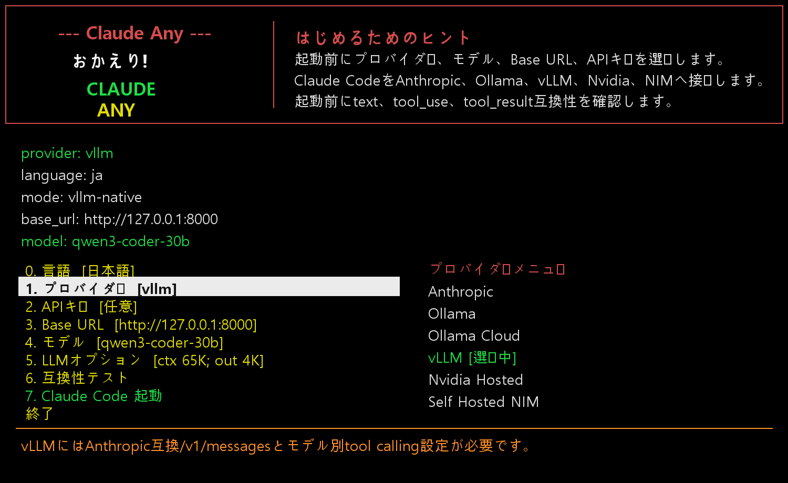
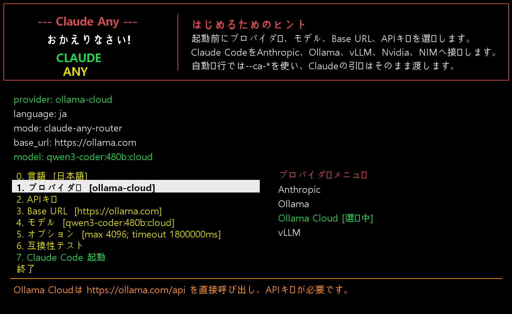
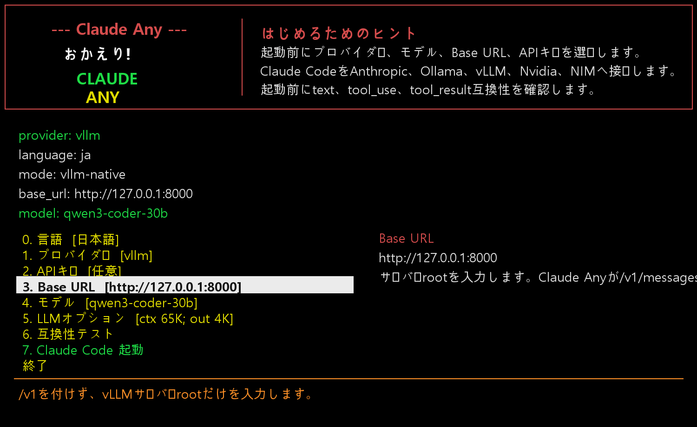
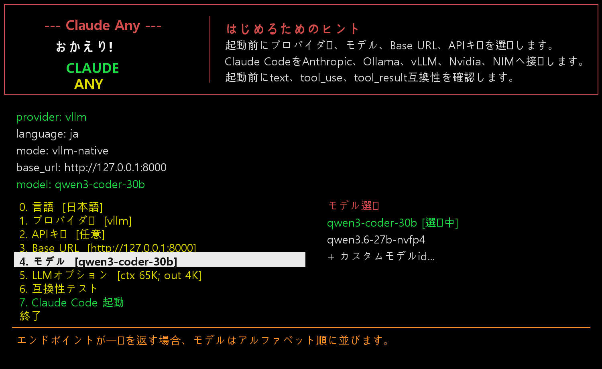
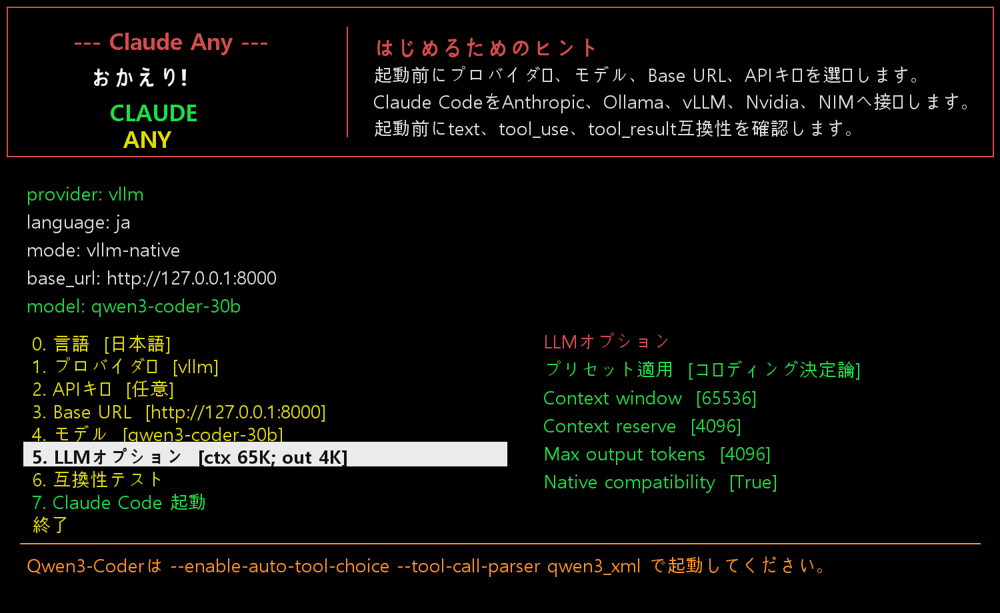
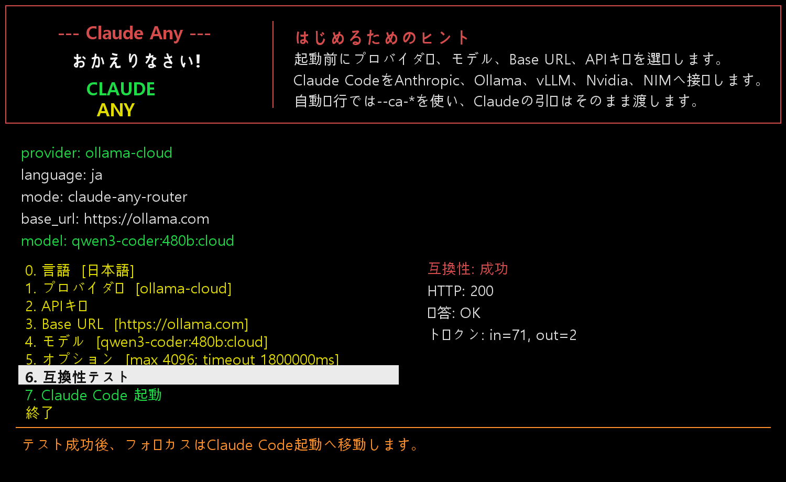

# Claude Any

<p align="center">
  
</p>


| [English](../README.md) | [한국어](README.ko.md) | 日本語 | [中文](README.zh.md) |
| --- | --- | --- | --- |

[](https://www.npmjs.com/package/@oneciel-ai/claude-any)
[](https://www.npmjs.com/package/@oneciel-ai/claude-any)
[](../LICENSE)

> ## 🚀 無料/低コストの LLM で Claude Code の全機能を
>
> - **無料** — [NVIDIA hosted NIM](https://build.nvidia.com/) (qwen3-coder-480b、gpt-oss など) を API Catalog から使用。
> - **低コスト** — [Ollama Cloud](https://ollama.com/cloud) で GLM、Qwen、DeepSeek などのオープン重みモデルを、フロンティアモデル比でごく安価に。
> - **無料 + ローカル** — [Ollama](https://ollama.com/) または [vLLM](https://github.com/vllm-project/vllm) を自分の GPU で完全オフライン実行。
> - **Plan Mode + Advisor 対応** — non-Anthropic provider でも Claude Code Plan Mode を維持し、長コンテキスト Advisor モデルで作業レビューを受けられます。
> - **無料モデルの RPM をなめらかに利用** — Claude Code はファイル読み取りや tool 実行に時間を使うため、Claude Any はその自然な間隔を RPM pacing に活用し、NVIDIA hosted の無料モデルでも分単位制限を感じにくく使えます。
>
> プロバイダー、モデル、Base URL、API キー、ストリーミング動作、LLM オプションを Claude Code 起動 **前** にコンソールメニューで選択します。Claude Code 本体はそのまま — すべてのネイティブツール、slash コマンド、ワークフローが維持されます。

## 今日追加されたトップ 3 ベネフィット

1. **non-Anthropic モデルでも Plan Mode が動作** — NVIDIA hosted、Ollama Cloud、ローカル Ollama、vLLM、NIM などの provider でも Claude Code Plan Mode を使えます。
2. **大きなモデルで Advisor レビュー** — 起動時に長コンテキスト Advisor Model を選び、Claude Code 内で `/advisor` を使って現在の作業、blocker、次の具体的な行動を確認できます。
3. **無料モデルの RPM 制限をよりなめらかに利用** — router-side RPM pacing がファイル読み取りや tool 実行にかかる自然な時間を活用するため、NVIDIA hosted の無料モデルを分単位制限内で待ち時間を感じにくく使えます。

### デモ


NVIDIA hosted NIM (deepseek-4-flash) を claude-any ルーター経由で Claude Code に接続。 &nbsp;[フル mp4 ⤓](https://github.com/OneCielAI/claude-any/raw/main/demo/claude-any-nvidia-nim.mp4)


Ollama Cloud (glm-5.1) を SSE 単語境界チャンキング有効状態で claude-any ルーターからストリーミング。 &nbsp;[フル mp4 ⤓](https://github.com/OneCielAI/claude-any/raw/main/demo/claude-any-ollama-cloud.mp4)

---

Claude Any は、Claude Code の起動前に Anthropic、Ollama、Ollama Cloud、
vLLM、NVIDIA hosted、self-hosted NIM を選択し、通常の Claude Code 引数を
そのまま渡すプロバイダー選択ランチャーです。

Credits: One Ciel LLC

現在のバージョン: `0.1.38`

## 作られた理由

Claude Code の最上位プランでも、長い作業ではトークンが不足したり、次の
クォータまで待つ必要があります。Claude Any は Claude Code を置き換える
ものではなく、作業を止めないための補助ツールです。NVIDIA NIM、Ollama
Cloud、vLLM、ローカル Ollama などを、要約、調査、ジャーナル、簡単な
コーディング、バックグラウンド作業に使えます。

プロバイダーが Anthropic 互換 Messages エンドポイントを提供する場合は、
その経路を優先して Claude Code のツール、権限、モデル選択、ワークフローを
できるだけ維持します。リモートプロバイダーが直接提供しにくい Web 検索は
別の MCP ツールで補完します。

起動前メニューはコンソールと SSH 作業を重視しています。Claude Code 起動前に
プロバイダー、モデル、Base URL、API キー、オプションを確認・変更できます。

macOS はまだ十分にテストしていませんが、portable Python と shell wrapper を
中心にしています。問題があれば知らせてください。

- D. Yun

## インストール

[](https://www.npmjs.com/package/@oneciel-ai/claude-any)
[](https://www.npmjs.com/package/@oneciel-ai/claude-any)

要件:

- Python 3.10+
- `claude` コマンドで実行できる Claude Code
- Node/npm (インストール shim および MCP Web ツール用)

**npm registry からインストール (推奨):**

```sh
npm install -g @oneciel-ai/claude-any
```

```sh
claude-any
```

## Claude Code を headless で直接起動

スクリプト、SSH セッション、CI ジョブ、親エージェントが事前メニューなしで
Claude Code を直接起動したい場合は headless mode を使います。
`claude-any` は `--ca-*` オプションを先に処理し、必要な local router を
起動してから、残りの引数を Claude Code にそのまま渡します。

```sh
claude-any --ca-provider nvidia-hosted --ca-model z-ai/glm-4.7
```

```sh
claude-any --ca-provider ollama-cloud --ca-model glm-5.1
```

```sh
claude-any --ca-provider ollama --ca-base-url http://127.0.0.1:11434 --ca-model qwen3-coder
```

1 回だけ実行する非対話 Claude Code prompt:

```sh
claude-any --ca-provider nvidia-hosted --ca-model z-ai/glm-4.7 --ca-no-update-check -p "Reply with OK only." --output-format text
```

保存済み provider/model を使い、メニューだけをスキップ:

```sh
CLAUDE_ANY_SKIP_MENU=1 claude-any -p "Summarize this repository." --output-format text
```

すべての起動オプションをフラグで渡す例:

```sh
claude-any --ca-provider nvidia-hosted --ca-base-url https://integrate.api.nvidia.com/v1 --ca-model z-ai/glm-4.7 --ca-advisor-model deepseek-ai/deepseek-v4-pro --ca-api-key-env NVIDIA_API_KEY --ca-max-output-tokens 4096 --ca-context-window 65536 --ca-request-timeout-ms 300000 --ca-rate-limit-rpm 40 --ca-rate-limit-status on --ca-no-update-check -p "Reply with OK only." --output-format text
```

同じ値を環境変数で指定:

```sh
export CLAUDE_ANY_SKIP_MENU=1
export CLAUDE_ANY_PROVIDER=nvidia-hosted
export CLAUDE_ANY_BASE_URL=https://integrate.api.nvidia.com/v1
export CLAUDE_ANY_MODEL=z-ai/glm-4.7
export CLAUDE_ANY_ADVISOR_MODEL=deepseek-ai/deepseek-v4-pro
export CLAUDE_ANY_API_KEY_ENV=NVIDIA_API_KEY
export CLAUDE_ANY_MAX_OUTPUT_TOKENS=4096
export CLAUDE_ANY_CONTEXT_WINDOW=65536
export CLAUDE_ANY_REQUEST_TIMEOUT_MS=300000
export CLAUDE_ANY_RATE_LIMIT_RPM=40
export CLAUDE_ANY_RATE_LIMIT_STATUS=on
claude-any -p "Reply with OK only." --output-format text
```

`.env` 方式では、同じ `CLAUDE_ANY_*` 値をファイルに保存して明示的に読み込みます:

```sh
claude-any --ca-env-file .env.claude-any -p "Reply with OK only." --output-format text
```

上書き順序は固定です: メニューで保存された最後のユーザー選択が基準になり、
OS 環境変数、`--ca-env-file` の `.env` 値、CLI `--ca-*` パラメータ、
`--ca-menu` で再度開いた UI での最終選択の順に上書きされます。

ヘッドレス対応範囲: provider、base URL、model、Advisor model、API key または
API-key 環境変数、max output、context window、request timeout、RPM limit、
RPM status 表示、streaming、web search、web fetch、Claude skills、update check、
language、Ollama context/options、通常の Claude Code passthrough 引数をすべて
メニューなしで設定できます。API key は `--ca-api-key` で直接渡せますが、
スクリプトでは shell history に秘密値を残さない `--ca-api-key-env` を推奨します。

その他の例は [manual](manual.md#headless-usage) を参照してください。

**アップグレード:**

```sh
npm update -g @oneciel-ai/claude-any
```

```sh
claude-any version
```

**アンインストール:**

```sh
npm uninstall -g @oneciel-ai/claude-any
```

### 別の取得方法

GitHub リポジトリから直接インストール (publish 間の未公開コミットを試したい時に便利):

```sh
npm install -g https://github.com/OneCielAI/claude-any.git
```

```sh
claude-any
```

POSIX 環境でソースからインストール:

```sh
git clone https://github.com/OneCielAI/claude-any.git
```

```sh
cd claude-any
```

```sh
./install.sh
```

```sh
claude-any
```

Windows PowerShell でソースからインストール:

```powershell
git clone https://github.com/OneCielAI/claude-any.git
```

```powershell
cd claude-any
```

```powershell
.\install.ps1
```

```powershell
claude-any
```

### リリース (メンテナー向け)

新しい GitHub Release が公開されると
[`Publish to npm`](../.github/workflows/npm-publish.yml) ワークフローが
自動的に npm へ公開します。ワークフローは `@oneciel-ai/claude-any` に対する
*Bypass 2FA for publishing* を有効にした granular token を、リポジトリ
secret `NPM_TOKEN` として受け取ります。

リリース手順:

1. `package.json` の `version` と `claude_any.py` の `VERSION` を上げる。
2. Changelog 項目を追加。
3. `git tag -a vX.Y.Z -m "..." && git push origin vX.Y.Z`.
4. `gh release create vX.Y.Z --title "..." --notes "..."` — publish ワークフローを起動。




## デモ



現在のデモは、プロバイダー選択、Base URL、モデル選択、LLM オプション、
互換性テストの順に表示します。互換性テストは単純なテキスト応答だけでなく、
必須の `tool_use` と `tool_result` の往復も確認します。

| プロバイダー | Base URL | モデル | LLM オプション | 互換性 |
| --- | --- | --- | --- | --- |
|  |  |  |  |  |

詳しい設定、headless フラグ、トラブルシューティングは [manual](manual.md) を
参照してください。デモ動画は [assets/claude-any-demo.ja.mp4](assets/claude-any-demo.ja.mp4)
にあります。

## 開発ストーリー

Claude Any は、実用的な統合テストの積み重ねとして作られました。まず
プロバイダー切り替えを試し、続いてモデル検出、API キー入力、互換性テスト、
Web 検索ツール、タイムアウト処理、Claude Code のネイティブ動作を確認
しました。得られた重要な結論は、プロバイダーが Anthropic 互換 Messages
エンドポイントを提供する場合、その経路が最もきれいな統合方法だという
ことです。Ollama、vLLM、NIM は Anthropic 互換ルートを提供でき、この経路は
汎用 OpenAI 互換 chat ルートよりも Claude Code のツールモデルを保ちやすい
ものでした。

ローカル Ollama と vLLM では、RTX 5090 および MSI GB10 クラスの環境で Qwen
3.6 27B Q4 も試しました。動作はしましたが、速度は native Claude Code や
Codex と直接比較する種類のものではありませんでした。このハイブリッド用途では
NVIDIA NIM や Ollama Cloud の hosted/cloud モデルが予想以上に実用的でした。

OpenAI 互換エンドポイントは、Claude Code 用の主経路から意図的に外しました。
テストでは、generic OpenAI chat 互換層を通した tool-call 変換が、tool
parameter、tool result、反復呼び出し、retry、モデル選択の周辺でより不安定
でした。そのため Claude Any は native Anthropic 互換 endpoint を優先し、
provider-specific な変換が必要な場合だけ小さな router を使います。

最近の vLLM テストでは、サーバー側の tool-call parser をモデル系列に合わせる
必要があることが分かりました。vLLM サーバーに接続でき、`/v1/messages` が
動作していても、`--tool-call-parser` が違うと Claude Code が tool call を
解析できず止まることがあります。Qwen3-Coder 系では `--enable-auto-tool-choice
--tool-call-parser qwen3_xml` を優先し、`hermes` は Hermes 形式のモデルや
一部の古い Qwen tool template 向けとして扱います。

## 推奨用途

速度が最重要ではないバックグラウンド運用に向いています。Docker ホスト管理、
Windows/Linux 管理、クリーンアップスクリプト、定期的なセキュリティ確認、
ログレビュー、Windows Event Log レビュー、ウイルス/ランサムウェア侵入試行
の整理、ブルートフォース試行の確認、レポート作成などです。

専用のセキュリティ製品を置き換えるものではありませんが、管理者が反復作業を
スクリプト化し、読みやすいレポートにまとめる補助として使えます。無料または
低コストのシステムセキュリティウォッチャーを作る用途にも向いています。

たとえば「Docker コンテナに PostgreSQL をインストールする」「今日の Docker
ログを分析してメールレポートにする」といった依頼を、コマンド、スクリプト、
スケジュールジョブ、要約にできます。

小さなモデルが検出と要約を行い、大きなモデルがレビュー、ポリシー、計画を
担当し、その後小さなモデルが監督下で反復作業を実行する階層型運用にも合います。

## 主な機能

- 英語、韓国語、日本語、中国語 UI の起動前メニュー。
- プロバイダー別モデル一覧とカスタムモデル入力。
- Claude Code チャット外での API キー設定。
- context window、output tokens、timeout、sampling、native compatibility の LLM オプション/プリセット。
- 起動前にテキスト、`tool_use`、`tool_result` を確認する互換性テスト。
- vLLM/NIM の `/v1/models` が `max_model_len` を返す場合は runtime context を表示。
- SSH とターミナル向けのコンソール優先 UI。
- Anthropic 互換エンドポイントがある場合は native 経路を優先。
- 必要に応じた provider-specific router。
- non-native provider 向け DuckDuckGo/fetch MCP。
- `--ca-provider`、`--ca-model`、`--ca-base-url` などの headless フラグ。
- router 経由の non-Anthropic provider で Claude Code Plan Mode に対応 —
  `EnterPlanMode` のローカル処理と plan artifact の流れを含みます。
- 選択した Advisor Model に現在の作業状態を送り、レビューを受ける `/advisor`
  slash command。長コンテキストの確認や次の一手の検証に便利です。
- Claude Code `statusLine` 連携により、router の RPM 使用量と待機時間を
  チャット本文ではなく下部ステータス領域に表示します。
- NVIDIA hosted、self-hosted NIM、Ollama、Ollama Cloud の router-side RPM 制御。
  `rate_limit_rpm=0` では throttling を無効化し、直近 60 秒の使用量だけを表示します。
- soft pacing はファイル読み取り、コマンド実行、tool 結果待ちにすでに使われた
  時間を待機計算から差し引きます。実際のコーディングセッションでは、こうした
  tool-call の間隔が RPM 間隔を自然に吸収するため、NVIDIA hosted NIM のような
  無料モデルの RPM 制限内に収めながら、各 Claude Code turn で rate limit を
  強く感じにくくします。
- Ollama/Ollama Cloud ルーター経路でのストリーミングプロキシ — トークンが届く
  すぐに Claude Code に転送し、レスポンス全体のバッファリングを待ちません。
- プロバイダー毎の `stream` on/off トグルと `stream_word_chunking` オプションで、
  text delta を単語境界でまとめて送信。長いストリーミング応答での tool-call /
  JSON 解析を壊しうる SSE 断片化を緩和します。
- LLM options メニューで強調表示された行の意味を、選択中の言語(英語/韓国語/
  日本語/中国語)で下部に表示。boolean 行(`Stream`、`Stream word chunking`、
  `Native compatibility`、`Think`)は Enter キー一つで即座にトグルします。
- Tool guard hook を Claude Code の hook event 全体に拡張(`WorktreeCreate` /
  `WorktreeRemove` 含む) — git リポジトリでない作業ディレクトリで Agent isolation が
  `Cannot create agent worktree: not in a git repository...` で失敗する問題を解消。
- 設定ファイルキャッシュ — ルーターがリクエストごとにディスクから読み込んでいた
  設定をメモリにキャッシュし、ファイル変更時のみ再読み込みします。

## 変更履歴

### 0.1.38

- **ユーザー選択の context window を優先**: NVIDIA hosted の 32K safety cap を
  削除しました。router は LLM options または headless 設定で選ばれた
  context window を使い、未設定の場合のみモデル別 fallback を使います。
- **NVIDIA preset 更新**: NVIDIA hosted preset は 65K から開始し、
  large-output/reasoning workflow では 256K まで使います。

### 0.1.37

- **Pseudo tool-call recovery**: NVIDIA/OpenAI-compatible stream 経路で
  `<|tool_calls_section_begin|>...` pseudo tool-call テキストを画面に出さず、
  可能な場合は Claude `tool_use` ブロックへ復元します。
- **Streaming defaults**: provider streaming の既定値は on です。NVIDIA hosted
  は安定性のため upstream streaming 経路に固定されます。

### 0.1.36

- **NVIDIA upstream streaming**: NVIDIA hosted router 呼び出しは upstream にも
  `stream=true` を使用します。長い応答を完全な non-streaming completion まで
  待たず、chunk として流せます。
- **Stream retry diagnostics**: streaming NVIDIA 呼び出しでも statusline 用の
  retry/request size activity 状態を維持します。

### 0.1.35

- **NVIDIA router context guard**: NVIDIA hosted の router context 既定値を 32K
  に下げ、LLM preset がこの cap を調整できるようにしました。長い Claude Code
  セッションで payload が肥大して timeout する状況を減らします。
- **Upstream activity status**: router が現在の request/retry/success/error
  状態と推定 token/byte サイズを記録し、statusline で upstream 待機と idle を
  判別できるようにしました。

### 0.1.34

- **完全な headless 設定経路**: `--ca-env-file`、環境変数マッピング、Advisor
  model、rate-limit、streaming、language、web-fetch の headless 制御を追加。
- **上書き順序を文書化**: 保存済みメニュー選択 < OS 環境変数 < `.env` ファイル <
  CLI パラメータ < `--ca-menu` で直接選んだ最終 UI 選択。

### 0.1.33

- **すべての README の先頭にロゴを追加**: 英語、韓国語、日本語、中国語 README
  の先頭に Claude Any ロゴを配置しました。
- **npm に画像アセットを同梱**: npm README でも GitHub と同じブランディングが
  表示されるよう、`logo.png`、`logo-small.png`、`claude-any-adv.png` をパッケージに含めました。

### 0.1.32

- **NVIDIA preset メニュー修正**: NVIDIA hosted で未対応の `native` option を
  LLM preset 適用時に触らないようにしました。Long context / Large output
  preset を選択してもメニューが終了しません。

### 0.1.31

- **既定 upstream timeout を 5 分へ変更**: 保存済み設定の 10/30 分既定
  timeout を 300000 ms に移行し、gateway stall を早く検出します。
- **言語別 gateway retry 表示**: 502/503/504 と socket timeout を自動再試行し、
  選択中の UI 言語で retry 進行状況をチャットに表示します。

### 0.1.30

- **Headless 起動ドキュメントを上部へ移動**: インストール直後の README で
  `--ca-provider`、`--ca-model`、`-p`、`CLAUDE_ANY_SKIP_MENU=1` を使って
  Claude Code を直接起動する copy-ready な例を確認できます。
- **NVIDIA hosted の文言整理**: provider/lifecycle ドキュメントで NVIDIA
  hosted を Claude Any local router 経由として説明し、hosted API Catalog に
  別 proxy が必要だという表現をなくしました。

### 0.1.29

- **NVIDIA 互換性テストの修正**: `claude-any test` は router mode のテスト前に
  local router を再起動します。npm upgrade 後も古い常駐 router が
  `nvd-claude-proxy` を要求する問題を避けます。
- **NVIDIA router 表示の整理**: メニューの状態表示を、廃止した local proxy
  経路ではなく claude-any local router 基準に更新しました。

### 0.1.28

- **Plan Mode + Advisor ヘッドライン**: router 経由の non-Anthropic provider での
  Plan Mode 対応と、選択した長コンテキスト Advisor Model で動作する `/advisor`
  slash command を文書化しました。
- **statusLine RPM 表示**: Claude Any が Claude Code `statusLine` command を
  インストールし、router の RPM 使用量と直近の待機時間を下部ステータス領域に表示します。
  rate-limit 情報でチャット本文を汚しません。
- **無料 hosted モデル向け soft RPM pacing**: NVIDIA hosted、self-hosted NIM、
  Ollama、Ollama Cloud で router-side RPM pacing を使えます。ファイル読み取り、
  コマンド実行、tool 結果待ちにすでに使われた時間を待機計算から差し引くため、
  実際のコーディング中の tool-call 間隔が RPM 間隔を自然に吸収します。
- **無制限時の使用量表示**: `rate_limit_rpm=0` は throttling を無効化しますが、
  直近 60 秒のリクエスト使用量は引き続き表示します。

### 0.1.27

- **non-Anthropic provider の Plan mode 対応**: ルーターは `EnterPlanMode` を残し、上流モデルが Claude Code 内部の Plan tool を安定して選択できない場合でも Claude Code Plan mode へ移行できるようにします。`tool_choice=EnterPlanMode` が強制されたリクエストには、ルーターがローカルで有効な Anthropic `tool_use` を返します。長い実装リクエストに対して短い、または空の実行不能なテキストだけが返った場合は、言語に依存しない構造チェックで `EnterPlanMode` に昇格します。
- **Plan-mode self-tool 処理**: 未対応の Claude Code self-tool は non-Anthropic provider では引き続き除去しますが、Plan-mode tool は別扱いにして planning 機能を無効化しません。

### 0.1.25

- **Plan mode 診断**: `~/.config/claude-any/log-level` に `TRACE` を書くと、`requests.jsonl` / `responses.jsonl` にリクエスト/レスポンス要約を記録します。
- **ヘッドレスエージェントチャット**: ルーターが `/ca/chat/messages`、`/ca/chat/wait`、`/ca/chat/stream` を提供します。サブ coding agent は最後に見た message id 以降の更新を取得したり、SSE で返信を待機できます。
- **Plan artifact 配信**: `/ca/plan/artifacts` で plan ファイルを作成し、ローカル URL として共有できます。Anthropic の内部実装はコピーせず、ファイル/アーティファクト中心の流れだけを独立実装しています。

### 0.1.24

- **初の npm registry 公開リリース**: 正しいスコープ `@oneciel-ai/claude-any` で公開しました。これまでの 0.1.x は registry にアップロードされていない状態でしたが、このバージョンから `npm install -g @oneciel-ai/claude-any` で直接インストール可能です。

### 0.1.23

- **ストリームトグル**: 各 non-Anthropic provider に `stream_enabled` 設定を追加
  (LLM options メニュー、`claude-anyctl ollama-options` / `provider-options`、
  headless フラグの全てで利用可能)。off にすると上流に `stream:false` を強制し、
  応答全体を Claude Code に返します — ストリーミング断片化で tool-call/JSON 解析が
  壊れる時の回避策。
- **単語境界ストリーミング**: `stream_word_chunking` オプションを追加。SSE text delta
  を空白/単語境界までバッファしてから送信します。Ollama ルーター経路と native
  パススルー経路(vLLM、NVIDIA hosted、self-hosted NIM)の両方に実装。Tool delta
  とテキスト以外の SSE イベントはそのまま透過します。
- **全 hook 処理**: `install_tool_guard_hooks` が Claude Code の全 hook event を登録
  (PreToolUse、PostToolUse、PostToolUseFailure、PostToolBatch、PermissionRequest、
  PermissionDenied、SessionStart/End、Setup、UserPromptSubmit/Expansion、Stop、
  StopFailure、InstructionsLoaded、ConfigChange、CwdChanged、Notification、
  SubagentStart/Stop、TeammateIdle、TaskCreated、TaskCompleted、PreCompact、PostCompact、
  WorktreeCreate、WorktreeRemove、Elicitation、ElicitationResult)。WorktreeCreate
  ハンドラが `worktreePath = base_path` を返すので、git リポジトリでないディレクトリ
  でも Agent isolation が動作します。
- **Windows hook 互換性**: `shell_command_string` が Windows でフォワードスラッシュと
  POSIX 引用を出力するように変更 — Claude Code の sh ベース hook 実行器が
  `C:\Users\...` のような Windows パスのバックスラッシュを escape として解釈して
  しまう問題を解消。
- **LLM options UX**: 強調行の説明をユーザー言語でパネル下部に表示。boolean トグル
  (`Stream`、`Stream word chunking`、`Native compatibility`、`Think`) は Enter で
  in-place に on/off を反転します — 入力プロンプト無し。

### 0.1.22

- **ヘッドレスマニュアル拡張**: 自動化と遠隔サーバー用に、headless setup / launch / test / passthrough / cleanup の実例を追加したマニュアル拡張。

### 0.1.21

- **サービスライフサイクルの文書化**: Claude Any は起動時に選択中 provider に必要な router/proxy だけを開始し、`claude-any stop` が明示的な cleanup コマンドであることを明確にしました。

### 0.1.20

- **NVIDIA hosted quick test**: `auto` モードでは NVIDIA hosted provider に対して text-only quick test を使用し、メニュー確認中の遅いまたは不安定な tool_use request を避けます。text + tool_use は `smoke`、完全な text/tool_use/tool_result round trip は `full` を使ってください。
- **メニューテストタイムアウト**: 端末メニューは `claude-any test 60 auto` を実行し、hosted model の pre-launch test をより素早く終えるようにします。

### 0.1.19

- **より速い互換性テスト**: `claude-any test` が `auto`、`smoke`、`full` モードをサポートします。
- **メニュー既定テストの高速化**: 端末メニューは `claude-any test 120 auto` を実行します。NVIDIA hosted の互換性確認は速くなり、完全検証は `claude-any test 180 full` で引き続き利用できます。

### 0.1.18

- **NVIDIA hosted 一時障害の診断**: 互換性テストが `RemoteDisconnected`、connection reset、502/503/504 応答を NVIDIA hosted backend/API Catalog の一時的な upstream failure として表示します。
- **NVIDIA proxy cleanup**: `claude-any stop` が `nvd-claude-proxy` 実行ファイルプロセスも検出して停止するため、古い proxy session をより確実に整理できます。

### 0.1.17

- **メニュー互換性テストのタイムアウト**: 端末メニューは互換性テストを明示的な 180 秒制限で実行し、hard limit を超えた場合は child process を停止します。遅い hosted model によってメニューが無期限に待機しているように見える問題を防ぎます。

### 0.1.16

- **NVIDIA hosted proxy 起動修正**: `python -m nvd_claude_proxy.main` に fallback する前に、インストール済みの `nvd-claude-proxy`/`ncp` 実行ファイルを検出して起動します。proxy が uv tool としてインストールされ、コマンドは存在するが Claude Any の Python interpreter から import できない環境をサポートします。

### 0.1.15

- **Ollama/Ollama Cloud ツール呼び出しストリーミング修正**: ストリーミングされるツール呼び出しを、連番の Anthropic SSE content block index と `input_json_delta` payload で送信するように変更。Claude Code が不正な streamed tool-use block を `Invalid tool parameters` として拒否する問題を防ぎます。
- **ツール guard の自動インストール**: 非 Anthropic provider の起動時に Claude Any tool guard を `~/.claude/settings.json` へマージし、実行前に生成されたツール入力を正規化します。
- **ツール呼び出し診断ログ**: ルーター側のツール呼び出しは `~/.config/claude-any/tool-calls.jsonl`、Claude Code hook 入力は `~/.claude/claude-any-tool-guard/tool-events.jsonl` に記録します。
- **ツール入力の正規化**: guard が `path` を `file_path`、`cmd` を `command`、`query` を `pattern` に変換し、必須フィールドが欠けている場合は明確な案内を返します。

### 0.1.14

- **SSH/ターミナル方向キー互換性**: `read_menu_key()` を適切な ANSI escape sequence パーサーで書き直し、raw 端末設定を `portable_select()` に移動してメニューループ中は端末が常に raw モードを維持するように変更。キー入力の間に `ECHO` が復元されてエスケープシーケンスが画面に漏れる問題を解消。方向キー、Home、End が SSH セッションで安定して動作します。
- **テストタイムアウト**: 遅いクラウドプロバイダー向けに、互換性テストのデフォルトタイムアウトを 60 秒から 120 秒に延長。
- **Ollama Cloud 互換性テスト修正**: 互換性テストリクエストに `"stream": false` を追加し、ルーターが Ollama Cloud に SSE ストリーミングではなく単一 JSON レスポンスを要求するように変更。これにより `post_json` がすべての SSE チャンクを収集している間にタイムアウトする問題を解決。

### 0.1.13

- **Ollama ストリーミングプロキシ**: ルーターが Ollama/Ollama Cloud のレスポンスを Anthropic SSE 形式でリアルタイムにストリーミングするようになりました。レスポンス全体をバッファリングしてから転送する方式から、トークン生成と同時に転送する方式に変更されました。
- **設定キャッシュ**: `load_config()` が設定ファイルをメモリにキャッシュし、ファイル変更時刻が変わった時だけ再読み込みします。ルーターの全リクエストで発生していたディスク I/O と JSON パースの繰り返しを削減しました。
- **トークン推定キャッシュ**: `estimate_tokens()` がオプションのキャッシュ dict を受け取り、単一リクエスト内の重複 `json.dumps()` 呼び出しを回避します。`ollama_chat_request` と `cap_output_tokens_for_context` が同じキャッシュを共有します。

### 0.1.12

- ドキュメントとデモアセットの更新。

### 0.1.11

- ツール呼び出し互換性の検証。

### 0.1.10

- テストでのランタイムコンテキスト表示。

### 0.1.9

- サーバーコンテキストに合わせたプリセット上限。

### 0.1.8

- LLM プリセットのローカライズ。

## プロバイダーの注意点

| Provider | Mode | Notes |
| --- | --- | --- |
| Anthropic | Native Claude Code | Claude login または Anthropic API key を使用。 |
| Ollama | Native 優先、必要時 router | ローカル Ollama は通常 API key 不要。ローカル Ollama で `:cloud` model を使う場合は Ollama host で `ollama signin` が必要。 |
| Ollama Cloud | Router | `https://ollama.com/api` を直接呼び出し、Ollama API key が必要。 |
| vLLM | Native Anthropic-compatible endpoint | Anthropic 互換 `/v1/messages` endpoint を使い、モデル系列に合う `--tool-call-parser` を指定。 |
| NVIDIA hosted | Router | NVIDIA hosted API Catalog を Claude Any local router 経由で使用。 |
| self-hosted NIM | Native Anthropic-compatible endpoint | self-hosted NIM の Anthropic 互換 endpoint を使用。 |

## サービスライフサイクル

Claude Any は、すべての backend helper を常時起動しておく設計ではありません。
通常のライフサイクルは次の通りです。

- 起動前に、管理中の router は `claude-any stop` で停止できます。
- `claude-any` が Claude Code を起動するとき、選択中 provider に必要な
  service だけを開始します。
- Ollama/Ollama Cloud router mode は `127.0.0.1:8799` の Claude Any router
  を使います。
- NVIDIA hosted router mode は `127.0.0.1:8799` の Claude Any router を使い、
  hosted API Catalog model には別の NVIDIA proxy は不要です。
- provider 切り替えテスト前に古い router が local port を保持している場合は、
  `claude-any stop` で整理してください。

この構成により、Claude Code は安定した Claude Any entry point を使いながら、
provider-specific helper は必要な時だけ起動できます。

## ヘッドレスエージェントチャット

ルーターが起動していれば、サブエージェントはメニューを開かずにローカル HTTP で連携できます。

```sh
curl -s http://127.0.0.1:8799/ca/chat/messages \
  -H 'content-type: application/json' \
  -d '{"channel":"agents","sender_id":"codex","recipients":["kimi"],"message":"失敗したテストログが必要です。"}'

curl -s 'http://127.0.0.1:8799/ca/chat/messages?channel=agents&recipient=kimi&after=0'

curl -N 'http://127.0.0.1:8799/ca/chat/stream?channel=agents&recipient=codex&after=10&timeout=300'

curl -s http://127.0.0.1:8799/ca/plan/artifacts \
  -H 'content-type: application/json' \
  -d '{"title":"handoff","name":"handoff.md","content":"# Plan\n- reproduce\n- patch\n- verify"}'
```

メッセージは `~/.config/claude-any/chat-messages.jsonl`、plan ファイルは
`~/.config/claude-any/plan-artifacts/` に保存されます。

Qwen3-Coder を Claude Code 用に vLLM で起動する例:

```sh
vllm serve Qwen/Qwen3-Coder-30B-A3B-Instruct \
  --host 0.0.0.0 \
  --port 8000 \
  --served-model-name qwen3-coder-30b \
  --max-model-len 65536 \
  --enable-auto-tool-choice \
  --tool-call-parser qwen3_xml
```

リンク:

- vLLM Claude Code integration: https://docs.vllm.ai/en/latest/serving/integrations/claude_code/
- vLLM tool calling: https://docs.vllm.ai/en/stable/features/tool_calling/

## ライセンス

MIT。詳細は [LICENSE](../LICENSE) を参照してください。
