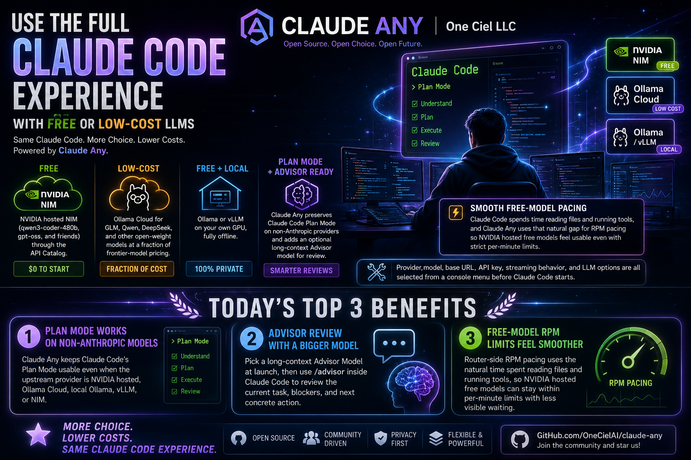
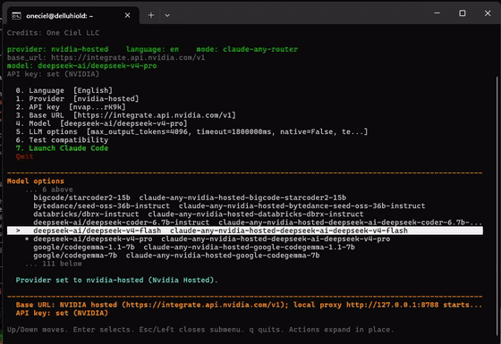
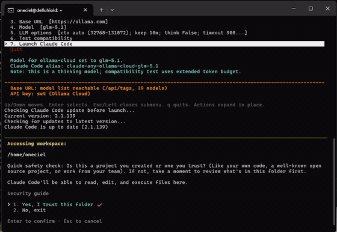
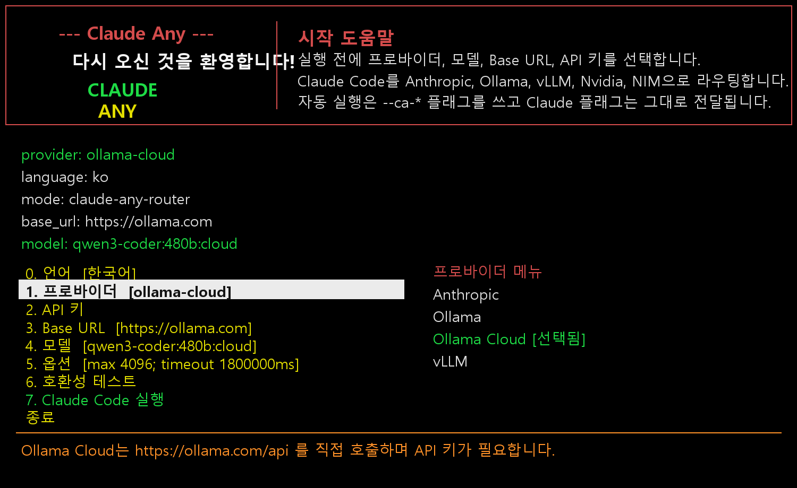
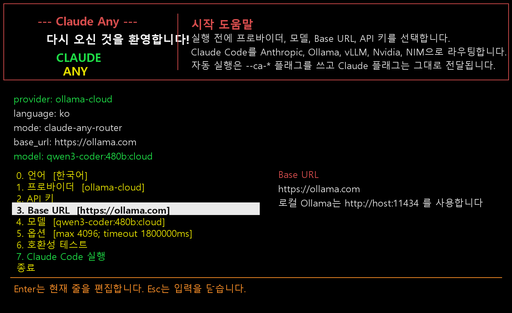
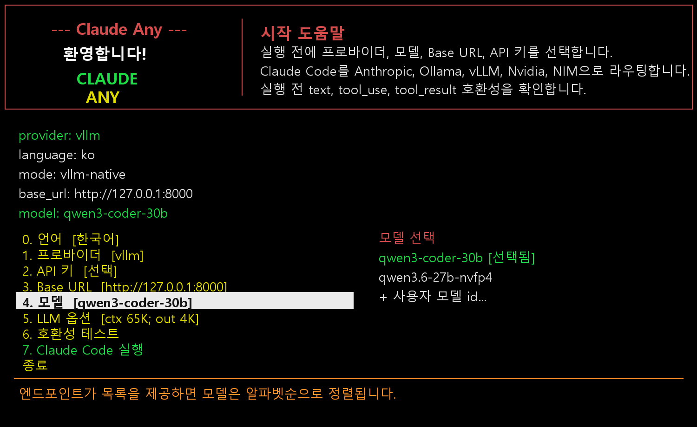
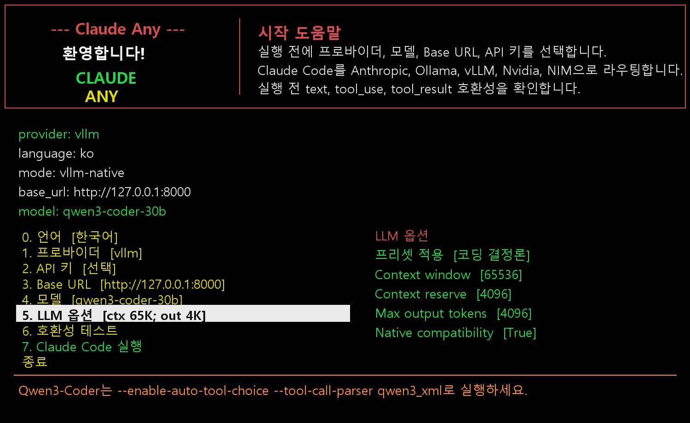
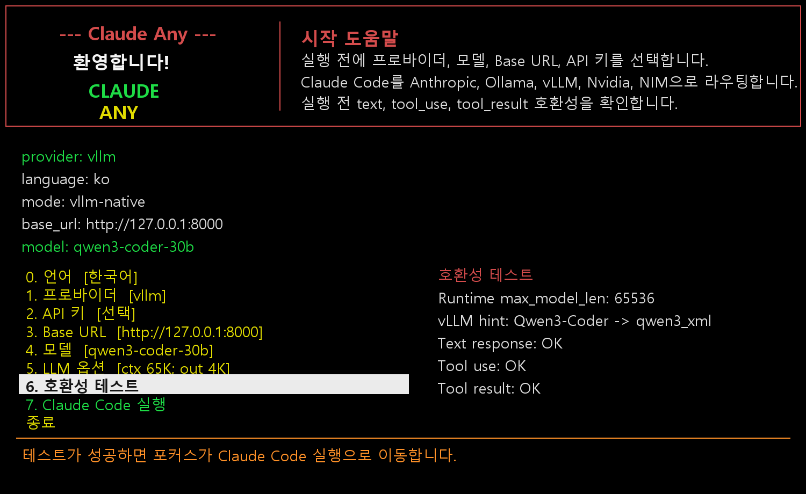

# Claude Any

<p align="center">
  
</p>



| [English](../README.md) | 한국어 | [日本語](README.ja.md) | [中文](README.zh.md) |
| --- | --- | --- | --- |

[](https://www.npmjs.com/package/@oneciel-ai/claude-any)
[](https://www.npmjs.com/package/@oneciel-ai/claude-any)
[](../LICENSE)

> ## 🚀 Claude Code의 모든 기능을 무료/저비용 LLM 으로
>
> - **무료** — [NVIDIA hosted NIM](https://build.nvidia.com/) (qwen3-coder-480b, gpt-oss 등) 을 API Catalog 로 사용.
> - **저비용** — [Ollama Cloud](https://ollama.com/cloud) 로 GLM, Qwen, DeepSeek 같은 오픈 가중치 모델을 frontier 모델 대비 매우 낮은 가격에 사용.
> - **무료 + 로컬** — [Ollama](https://ollama.com/) 또는 [vLLM](https://github.com/vllm-project/vllm) 을 본인 GPU 에서 완전 오프라인으로 사용.
> - **Plan Mode + Advisor 지원** — non-Anthropic provider 에서도 Claude Code Plan Mode 를 유지하고, 긴 컨텍스트 Advisor 모델로 작업 검토를 받을 수 있습니다.
> - **세션 브라우저 채팅** — router가 `/ca/web/chat`을 제공하며, 브라우저 메시지를 active Claude Code 세션의 channel inbox로 주입하고 같은 channel stream으로 답장을 받습니다. active 세션의 Claude Code 도구와 MCP 도구를 그대로 사용할 수 있습니다.
> - **무료 모델 RPM을 부드럽게 사용** — Claude Code 는 파일을 읽고 tool 을 실행하는 시간이 있고, Claude Any 는 그 자연스러운 간격을 RPM pacing 에 활용하므로 NVIDIA hosted 무료 모델의 분당 제한을 덜 체감하며 사용할 수 있습니다.
>
> 프로바이더, 모델, Base URL, API 키, 스트리밍 동작, LLM 옵션을 Claude Code 실행 **전에** 콘솔 메뉴에서 모두 선택합니다. Claude Code 본체는 그대로 — 모든 native 툴링, slash command, 워크플로우가 유지됩니다.

## 오늘 추가된 최고의 3가지 베네핏

### 2026-05-25

1. **DeepSeek.com 프로바이더 지원** — DeepSeek의 Anthropic 호환 Claude Code 엔드포인트를 정식 프로바이더로 선택할 수 있고, 모델 프리셋과 API 키 설정 흐름을 제공합니다.
2. **공유 서버에서 더 안전한 라우터 수명주기** — 라우터가 기본적으로 사용자별 안정 포트를 사용하고, 같은 사용자의 stale router를 실행 전에 정리해 Robert/Sarah 같은 다중 세션이 서로 섞이는 문제를 줄였습니다.
3. **Router 세션 브라우저 채팅과 선택형 Anthropic 라우팅** — `/ca/web/chat`으로 active Claude Code 세션에 메시지를 주입하고 channel stream으로 답장을 받는 로컬 router 채팅 화면을 제공하고, Anthropic도 필요할 때 Claude Any router를 경유해 SSE, 채널, 관측 기능을 사용할 수 있습니다.

### 2026-05-18

1. **외부 에이전트용 실시간 채널 브리지** — Claude Any가 `/ca/channel/*` 엔드포인트와 SSE connector를 제공해 AI-Net 같은 시스템의 실시간 에이전트 메시지를 Claude Code 세션으로 밀어 넣을 수 있습니다.
2. **Advisor 피드백을 보고 실행 흐름에 반영** — Advisor 리뷰를 Claude Code transcript에 요약해서 보여주고, 계획 승인이나 위험한 진행 지점 전에 executor 모델에게 다시 전달할 수 있습니다.
3. **non-Anthropic 워크플로우 호환성 강화** — Cron 스타일 작업 예약, 채널 polling, router-native coordination command를 Claude Code native 동작에 더 가깝게 모델링했습니다.

### 2026-05-15

1. **Router 관리 페이지가 메뉴형으로 정리** — 내장 router 홈 화면을 Overview, LLM Settings, Events, Endpoints 상단 메뉴로 나눠 모든 정보가 한 화면에 길게 쌓이지 않도록 했습니다.
2. **더 안전한 원격 디버그 노출** — router 외부 접속은 기본 off이며, 명시적으로 확인된 토글이 있어야 켜집니다. Claude Code 안에서 `/router-debug`로 켜고 끌 수 있고, bind 주소가 즉시 반영되도록 router를 자동 재시작합니다.
3. **운영자용 관측성과 실시간 설정** — 구조화된 event 화면과 live LLM 설정 UI를 제공해 긴 Claude Code 세션을 config 파일 편집 없이 모니터링하고 조정할 수 있습니다.

### 2026-05-14

1. **Plan Mode 루프 복구를 하드코딩이 아닌 의미 기반으로 처리** — 변경 없는 `Read` 결과를 이전의 권위 있는 관측값과 현재 Plan Mode 상태로 변환해, Claude Code가 같은 구간을 반복해서 읽지 않고 `ExitPlanMode` 또는 다음 실제 단계로 넘어갈 수 있습니다.
2. **원격 테스트용 router 공개 바인딩 지원** — 다른 머신에서 router를 테스트해야 할 때 `CLAUDE_ANY_ROUTER_BIND_HOST=0.0.0.0`을 설정할 수 있고, Claude Code 내부 client base는 안전하게 로컬 주소를 유지합니다.
3. **서드파티 모델용 transcript 정리 강화** — attachment-only 메타데이터, 과거 no-op tool 결과, orphan tool 결과를 Ollama, Ollama Cloud, NVIDIA hosted, vLLM, NIM으로 보내기 전에 정규화합니다.

### 2026-05-13

1. **non-Anthropic 모델에서도 Plan Mode 동작** — NVIDIA hosted, Ollama Cloud, 로컬 Ollama, vLLM, NIM 같은 provider 에서도 Claude Code Plan Mode 를 사용할 수 있습니다.
2. **더 큰 모델로 Advisor 리뷰** — 실행 시 긴 컨텍스트 Advisor Model 을 선택하고, Claude Code 안에서 `/advisor`로 현재 작업, blocker, 다음 구체적 행동을 검토할 수 있습니다.
3. **무료 모델 RPM 제한을 더 부드럽게 사용** — router-side RPM pacing 이 파일 읽기와 tool 실행에 걸리는 자연스러운 시간을 활용하므로, NVIDIA hosted 무료 모델을 분당 제한 안에서 덜 기다리며 사용할 수 있습니다.

### 데모



NVIDIA hosted NIM (deepseek-4-flash) 이 claude-any 라우터를 통해 Claude Code 를 구동. &nbsp;[전체 mp4 ⤓](https://github.com/OneCielAI/claude-any/raw/main/demo/claude-any-nvidia-nim.mp4)



Ollama Cloud (glm-5.1) 를 SSE 단어경계 청킹 활성화 상태에서 claude-any 라우터로 스트리밍. &nbsp;[전체 mp4 ⤓](https://github.com/OneCielAI/claude-any/raw/main/demo/claude-any-ollama-cloud.mp4)

---

Claude Any는 Claude Code 실행 전에 Anthropic, Ollama, Ollama Cloud,
DeepSeek.com, OpenCode Zen, OpenCode Go, vLLM, NVIDIA hosted, self-hosted NIM을 선택하고, Claude Code의
일반 인자는 그대로 전달하는 프로바이더 선택 런처입니다.

Credits: One Ciel LLC

현재 버전: `0.1.102`

## 왜 만들었나

Claude Code의 가장 높은 플랜을 사용해도 긴 작업 중에는 토큰이 부족해지거나,
다음 토큰이 열릴 때까지 세션을 이어가기 어려운 순간이 생깁니다. Claude Any는
Claude Code를 대체하려는 도구가 아니라, 작업 흐름을 멈추지 않기 위한 보조
도구입니다. NVIDIA NIM, Ollama Cloud, vLLM, 로컬 Ollama처럼 충분히 쓸만한
프로바이더를 요약, 조사, 저널, 간단한 코딩, 백그라운드 위임 작업에 사용할 수
있습니다.

가능한 경우 Anthropic 호환 Messages 엔드포인트를 우선 사용해 Claude Code의
툴링, 권한, 모델 선택, 작업 흐름의 장점을 최대한 유지합니다. 원격 프로바이더가
직접 제공하기 어려운 웹검색은 별도의 MCP 도구로 보강합니다.

실행 전 메뉴는 콘솔과 SSH 작업을 우선 고려했습니다. Claude Code가 시작되기
전에 프로바이더, 모델, Base URL, API 키, 옵션을 쉽게 확인하고 바꿀 수 있습니다.

macOS에서는 아직 충분히 테스트하지 않았지만, portable Python과 shell wrapper
중심으로 작성했습니다. 문제가 있으면 알려주세요.

- D. Yun

## 설치

[](https://www.npmjs.com/package/@oneciel-ai/claude-any)
[](https://www.npmjs.com/package/@oneciel-ai/claude-any)

요구사항:

- Python 3.10+
- `claude` 명령으로 실행 가능한 Claude Code
- Node/npm (설치 shim 과 선택적인 MCP 웹 도구용)

**npm registry 에서 설치 (권장):**

```sh
npm install -g @oneciel-ai/claude-any
```

```sh
claude-any
```

## Claude Code를 headless로 바로 실행

스크립트, SSH 세션, CI 작업, 상위 에이전트가 실행 전 메뉴 없이 Claude Code를
바로 시작해야 할 때 headless mode를 사용합니다. `claude-any`는 `--ca-*`
옵션을 먼저 소비하고, 필요한 local router를 시작한 뒤, 나머지 인자를 Claude
Code에 그대로 넘깁니다.

```sh
claude-any --ca-provider nvidia-hosted --ca-model z-ai/glm-4.7
```

```sh
claude-any --ca-provider ollama-cloud --ca-model glm-5.1
```

```sh
claude-any --ca-provider ollama --ca-base-url http://127.0.0.1:11434 --ca-model qwen3-coder
```

한 번만 실행하는 비대화형 Claude Code prompt:

```sh
claude-any --ca-provider nvidia-hosted --ca-model z-ai/glm-4.7 --ca-no-update-check -p "Reply with OK only." --output-format text
```

저장된 provider/model을 그대로 쓰고 메뉴만 건너뛰기:

```sh
CLAUDE_ANY_SKIP_MENU=1 claude-any -p "Summarize this repository." --output-format text
```

모든 실행 옵션을 플래그로 전달:

```sh
claude-any --ca-provider nvidia-hosted --ca-base-url https://integrate.api.nvidia.com/v1 --ca-model z-ai/glm-4.7 --ca-advisor-model deepseek-ai/deepseek-v4-pro --ca-api-key-env NVIDIA_API_KEY --ca-max-output-tokens 4096 --ca-context-window 65536 --ca-request-timeout-ms 120000 --ca-rate-limit-rpm 0 --ca-rate-limit-status off --ca-no-update-check -p "Reply with OK only." --output-format text
```

같은 값을 환경변수로 설정:

```sh
export CLAUDE_ANY_SKIP_MENU=1
export CLAUDE_ANY_PROVIDER=nvidia-hosted
export CLAUDE_ANY_BASE_URL=https://integrate.api.nvidia.com/v1
export CLAUDE_ANY_MODEL=z-ai/glm-4.7
export CLAUDE_ANY_ADVISOR_MODEL=deepseek-ai/deepseek-v4-pro
export CLAUDE_ANY_API_KEY_ENV=NVIDIA_API_KEY
export CLAUDE_ANY_MAX_OUTPUT_TOKENS=4096
export CLAUDE_ANY_CONTEXT_WINDOW=65536
export CLAUDE_ANY_REQUEST_TIMEOUT_MS=120000
export CLAUDE_ANY_RATE_LIMIT_RPM=0
export CLAUDE_ANY_RATE_LIMIT_STATUS=off
claude-any -p "Reply with OK only." --output-format text
```

`.env` 방식은 같은 `CLAUDE_ANY_*` 값을 파일에 저장한 뒤 명시적으로 불러옵니다:

```sh
claude-any --ca-env-file .env.claude-any -p "Reply with OK only." --output-format text
```

오버라이드 순서는 고정되어 있습니다: 메뉴에서 저장된 최종 사용자 선택값이
기본값이고, OS 환경변수, `--ca-env-file`의 `.env` 값, CLI `--ca-*` 파라미터,
`--ca-menu`로 다시 연 인터페이스에서 사용자가 직접 고른 값 순서로 덮어씁니다.

헤드리스 지원 범위: provider, base URL, model, Advisor model, API key 또는
API-key 환경변수, max output, context window, request timeout, RPM limit,
RPM status 표시, streaming, web search, web fetch, Claude skills, update check,
language, Ollama context/options, provider-specific option, 일반 Claude Code
passthrough 인자를 모두 메뉴 없이 설정할 수 있습니다. API key는
`--ca-api-key`로 직접 전달할 수 있지만, 스크립트에서는 shell history에
비밀값이 남지 않는 `--ca-api-key-env`를 권장합니다.

최근 추가된 provider도 같은 방식으로 한 번에 설정할 수 있습니다:

```sh
claude-any --ca-provider deepseek --ca-base-url https://api.deepseek.com/anthropic --ca-model deepseek-v4-pro --ca-api-key-env DEEPSEEK_API_KEY --ca-no-launch
```

```sh
claude-any --ca-provider opencode --ca-base-url https://opencode.ai/zen --ca-model claude-sonnet-4-6 --ca-api-key-env OPENCODE_ZEN_API_KEY --ca-no-launch
```

```sh
claude-any --ca-provider opencode-go --ca-base-url https://opencode.ai/zen/go --ca-model qwen3.6-plus --ca-api-key-env OPENCODE_GO_API_KEY --ca-provider-option endpoint:custom-model=chat --ca-no-launch
```

`--ca-provider-option KEY=VALUE`는 현재 provider에 옵션을 적용하고,
`--ca-set-provider-option PROVIDER KEY=VALUE`는 현재 provider를 바꾸지 않고
특정 provider 옵션을 저장합니다. OpenCode endpoint override는
`endpoint:<model-id>=messages|chat|responses|gemini` 형식입니다.

더 많은 예시는 [헤드리스 예제](#헤드리스-에이전트-채팅)와
[전체 manual](manual.md#headless-usage)을 참고하세요.

**업그레이드:**

```sh
npm update -g @oneciel-ai/claude-any
```

```sh
claude-any version
```

**제거:**

```sh
npm uninstall -g @oneciel-ai/claude-any
```

### 다른 설치 경로

GitHub 저장소에서 직접 설치 (publish 사이의 미릴리스 커밋을 시험할 때 유용):

```sh
npm install -g https://github.com/OneCielAI/claude-any.git
```

```sh
claude-any
```

POSIX 소스 설치:

```sh
git clone https://github.com/OneCielAI/claude-any.git
```

```sh
cd claude-any
```

```sh
./install.sh
```

```sh
claude-any
```

Windows PowerShell 소스 설치:

```powershell
git clone https://github.com/OneCielAI/claude-any.git
```

```powershell
cd claude-any
```

```powershell
.\install.ps1
```

```powershell
claude-any
```

### 릴리즈 (메인테이너용)

[`Publish to npm`](../.github/workflows/npm-publish.yml) 워크플로가
`main` 또는 `nightly` 브랜치 push 때 자동으로 npm 에 배포합니다.
워크플로는 `@oneciel-ai/claude-any` 에 대한 *Bypass 2FA for publishing*
권한이 있는 granular token 을 저장소 secret `NPM_TOKEN` 으로 받습니다.

로컬 체크아웃에서 `npm publish` 를 직접 실행하지 마세요. 로컬 npm 인증은
GitHub Actions 의 `NPM_TOKEN` 과 다를 수 있고, 실제 브랜치 push 배포는
성공했는데도 로컬에서는 `E401`/`E404` 로 보일 수 있습니다.

릴리즈 절차:

1. `nightly` 작업은 `nightly` 브랜치에 커밋하고 `git push origin nightly`.
2. 안정 릴리즈는 `nightly` 를 `main` 으로 병합하고 `git push origin main`.
3. `Publish to npm` 워크플로 성공 여부 확인.
4. 안정 릴리즈는 npm 배포 확인 후 GitHub Release 를 생성.


## 데모


현재 데모는 프로바이더 선택, Base URL, 모델 선택, LLM 옵션, 호환성 테스트
순서로 구성되어 있습니다. 호환성 테스트는 단순 텍스트 응답뿐 아니라 필수
`tool_use`와 `tool_result` 후속 응답까지 확인합니다.

| 프로바이더 | Base URL | 모델 | LLM 옵션 | 호환성 |
| --- | --- | --- | --- | --- |
|  |  |  |  |  |

자세한 설정법, headless 플래그, 문제 해결은 [manual](manual.md)을 참고하세요.
데모 영상은 [assets/claude-any-demo.ko.mp4](assets/claude-any-demo.ko.mp4)에 있습니다.

## 개발 스토리

Claude Any는 실제적인 통합 테스트의 연속으로 만들어졌습니다. 먼저 프로바이더
전환을 시도했고, 이어서 모델 목록 조회, API 키 입력, 호환성 테스트, 웹검색
툴링, 타임아웃 처리, Claude Code 기본 동작 보존을 차례로 확인했습니다. 가장
유용한 결론은 프로바이더가 Anthropic 호환 Messages 엔드포인트를 제공할 때 그
경로가 가장 깔끔한 통합 방식이라는 점이었습니다. Ollama, vLLM, NIM은 모두
Anthropic 호환 경로를 제공할 수 있고, 이 경로는 일반 OpenAI 호환 chat 경로보다
Claude Code의 툴링 모델을 더 잘 보존할 수 있습니다.

로컬 Ollama와 vLLM에서는 RTX 5090 및 MSI GB10급 장비에서 Qwen 3.6 27B Q4도
테스트했습니다. 동작은 했지만 Claude native나 Codex와 직접 비교할 속도 범주는
아니었습니다. 하이브리드 백그라운드 작업에는 오히려 NVIDIA NIM과 Ollama Cloud
쪽에서 체감 성능이 괜찮았던 모델들이 있었습니다.

OpenAI 호환 엔드포인트는 Claude Code 사용을 위한 기본 경로에서 의도적으로
제외했습니다. 테스트 중 generic OpenAI chat 호환 계층을 통한 tool-call 변환은
tool parameter, tool result, 반복 호출, retry, 모델 선택 주변에서 더 불안정한
동작을 보였습니다. 그래서 Claude Any는 native Anthropic 호환 endpoint를 우선
사용하고, provider-specific 변환이 필요한 경우에만 작은 router를 사용합니다.

최근 vLLM 테스트에서 확인한 중요한 점은 서버의 tool-call parser가 모델 계열과
정확히 맞아야 한다는 것입니다. vLLM 서버가 접속 가능하고 `/v1/messages`가
동작해도 `--tool-call-parser`가 틀리면 Claude Code가 tool call을 파싱하지 못하고
멈출 수 있습니다. Qwen3-Coder 계열은 `--enable-auto-tool-choice
--tool-call-parser qwen3_xml` 조합을 우선 사용해야 하며, `hermes`는 Hermes 형식
모델이나 일부 오래된 Qwen tool template에 맞는 선택입니다.

## 추천 사용처

속도가 핵심이 아닌 백그라운드 운영 작업에 적합합니다. Docker 호스트 관리,
Windows/Linux 서버 관리, 정리 스크립트, 주기적인 보안 점검, 로그 리뷰,
Windows 이벤트 로그 리뷰, 바이러스/랜섬웨어 침입 시도 정리, 무차별 로그인
시도 리뷰, 리포트 초안 생성 등에 추천합니다.

전문 보안 도구를 대체하지는 않지만, 반복 점검을 스크립트와 보고서로 정리하는
서버 관리자 보조 역할에 유용합니다. 이런 방식으로 무료 또는 저비용의 시스템
보안 지키미를 만들 수 있습니다.

예를 들어 "Docker 컨테이너에 PostgreSQL 설치해줘", "오늘 Docker 로그를 분석해서
이메일 리포트로 보내줘" 같은 요청을 명령어, 스크립트, 스케줄 작업, 요약 보고서로
구체화할 수 있습니다.

작은 모델이 탐지와 요약을 맡고, 큰 모델이 리뷰와 정책, 계획을 담당한 뒤,
다시 작은 모델이 큰 모델의 감독 아래 반복 작업을 수행하는 계층형 운영에도
잘 맞습니다.

## 주요 기능

- 영어, 한국어, 일본어, 중국어 UI를 가진 실행 전 프로바이더 선택 메뉴.
- 프로바이더별 모델 목록과 사용자 모델 직접 입력.
- Claude Code 채팅 입력 밖에서 API 키 설정.
- context window, output tokens, timeout, sampling, native compatibility를 위한 LLM 옵션/프리셋.
- 실행 전 텍스트, `tool_use`, `tool_result` 호환성 테스트.
- vLLM/NIM의 `/v1/models`가 `max_model_len`을 제공하면 런타임 컨텍스트 표시.
- SSH와 터미널 작업에 맞춘 콘솔 우선 메뉴.
- Anthropic 호환 엔드포인트가 있는 경우 native 경로 우선.
- 필요한 경우 provider-specific router 사용.
- non-native provider용 DuckDuckGo/fetch MCP 연결.
- `--ca-provider`, `--ca-model`, `--ca-base-url`, `--ca-api-key-env` 등 headless 플래그.
- router 기반 non-Anthropic provider 에서 Claude Code Plan Mode 지원 —
  `EnterPlanMode` 로컬 처리와 plan artifact 흐름을 포함합니다.
- 선택한 Advisor Model 로 현재 작업 상태를 보내 검토받는 `/advisor` slash command.
  긴 컨텍스트 리뷰와 다음 단계 확인에 유용합니다.
- 선택적으로 Claude Code `statusLine` 연동으로 router RPM 사용량과 wait 시간을 채팅 본문이
  아니라 하단 상태 영역에 표시할 수 있습니다.
- NVIDIA hosted, self-hosted NIM, Ollama, Ollama Cloud 에 대한 router-side RPM 제어.
  기본값은 `rate_limit_rpm=0`, `rate_limit_status=off`이며, 양수 RPM과 status 표시를 켜면
  router pacing telemetry를 사용할 수 있습니다.
- soft pacing 은 파일 읽기, 명령 실행, tool 결과 대기에 이미 소비된 시간을 지연
  계산에서 뺍니다. 실제 코딩 세션에서는 이런 tool-call 간격이 RPM 간격을 자연스럽게
  흡수하므로, NVIDIA hosted NIM 같은 무료 모델의 RPM 제한 안에서 동작하면서도 매
  Claude Code turn 마다 rate limit 을 강하게 느끼지 않게 합니다.
- Ollama/Ollama Cloud 라우터 경로의 스트리밍 프록시 — 전체 응답을 기다리지 않고
  토큰이 도착하는 즉시 Claude Code로 전달합니다.
- 프로바이더별 `stream` on/off 토글과 `stream_word_chunking` 옵션으로 텍스트
  delta 를 단어 경계 단위로 묶어서 전송 — 긴 스트리밍 응답에서 tool-call /
  JSON 파싱을 깨뜨릴 수 있는 SSE 단편화 문제를 완화합니다.
- LLM options 메뉴에서 강조된 행의 의미를 현재 언어(영어/한국어/일본어/중국어)로
  하단에 표시하고, boolean 행(`Stream`, `Stream word chunking`,
  `Native compatibility`, `Think`) 은 Enter 키 한 번에 즉시 토글됩니다.
- Tool guard hook 등록을 Claude Code 의 전체 hook event 로 확장
  (`WorktreeCreate` / `WorktreeRemove` 포함) — git 저장소가 아닌 작업 디렉터리에서
  Agent isolation 이 `Cannot create agent worktree: not in a git repository...`
  에러로 실패하던 문제 해결.
- 설정 파일 캐싱 — 라우터의 요청마다 디스크에서 읽던 설정을 메모리에 캐시하여
  파일 수정 시에만 다시 읽습니다.

## 변경 이력

### 0.1.71

- **MCP SSE channel 초기화**: channel bridge가 MCP `endpoint` 이벤트를 받으면
  `initialize`와 `notifications/initialized`를 자동 전송하므로, AI-Net 스타일
  push notification이 Claude Any로 흐를 수 있습니다.
- **Channel SSE 진단 정보**: connector 상태에 MCP endpoint, 초기화 여부, 마지막
  MCP 초기화 오류를 표시합니다.

### 0.1.70

- **Linux 메뉴 디버그 로그 수정**: key-debug 로그를 전역 `/tmp`가 아니라 사용자
  Claude Any config 디렉터리 아래에 기록해, 제한된 Linux 환경에서 permission
  crash가 발생하지 않도록 했습니다.
- **best-effort key logging**: 선택적 key-debug 로그를 쓸 수 없어도 메뉴 입력이
  실패하지 않습니다.

### 0.1.69

- **실시간 채널 브리지**: `/ca/channel/messages`, `/ca/channel/wait`,
  `/ca/channel/stream`, `/ca/channel/notify`, runtime SSE connector control을
  추가해 외부 시스템이 Claude Any로 live message를 전달할 수 있습니다.
- **`/channel` slash command**: Claude Code 안에서 bridge 상태 확인, polling,
  wait, message send, SSE connector 상태 확인을 수행할 수 있습니다.
- **Advisor 및 coordination 호환성 강화**: Advisor 피드백을 visible transcript와
  executor flow에 요약 반영하고, channel/Cron 호환 tool schema로 서드파티 모델
  세션이 Claude Code native 동작에 더 가까워졌습니다.

### 0.1.68

- **탭형 router 관리 페이지**: router 루트 페이지를 Overview, LLM Settings, Events, Endpoints 상단 메뉴로 분리해 원격 관리 화면이 커져도 다루기 쉽게 했습니다.
- **안전한 `/router-debug` 토글**: 외부 router 노출은 기본 off이며, 명시 확인값이 같이 있어야 켜집니다. Claude Code 안에서 `/router-debug`로 토글할 수 있고, bind 주소가 바로 바뀌도록 router가 자동 재시작됩니다.
- **main 브랜치 npm 자동화**: `main`으로 push/merge되면 npm publish workflow가 트리거됩니다. 단, 같은 package version이 이미 npm에 있으면 중복 publish를 건너뜁니다.

### 0.1.67

- **빠른 prelaunch 탐색**: 방향키 redraw가 `mode:` 라벨 하나를 그리기 위해
  router `/health` endpoint를 호출하지 않으므로, router가 꺼져 있거나 느릴 때도
  키 입력마다 지연되지 않습니다.
- **붙여넣기 지연 완화**: portable raw 입력 프롬프트가 붙여넣기 burst를 한 번에
  drain하고 batch 단위로 flush합니다.

### 0.1.66

- **tmux/zsh TUI 입력 수정**: portable menu 입력 프롬프트가 이제 fragile한
  terminal echo 복구에 의존하지 않고 raw terminal mode에서 직접 글자 표시,
  붙여넣기, Backspace/Delete, Ctrl-U 전체 삭제를 처리합니다.
- **Issue-linked release flow**: GitHub release/manual dispatch 외에도 `v*`
  태그 push로 npm publish workflow를 자동 트리거할 수 있습니다.

### 0.1.65

- **Plan Mode unchanged-Read 루프 복구**: router 변환이 변경 없는/no-op
  `Read`에 대해 이전 성공 `Read` 결과를 유지하고, 현재 Plan Mode 상태를
  서드파티 모델에 전달하며, 임의 retry 횟수 제한 없이 다음 단계로 이동하도록
  돕습니다.
- **서드파티 transcript 정리 강화**: attachment-only 메타데이터, 과거 no-op
  tool 결과, orphan tool 결과를 Ollama, Ollama Cloud, NVIDIA hosted, vLLM,
  NIM으로 보내기 전에 정규화합니다.
- **원격 router 테스트 바인딩**: 의도적인 원격 테스트에는
  `CLAUDE_ANY_ROUTER_BIND_HOST=0.0.0.0`을 사용할 수 있고, Claude Code는
  계속 로컬 client base URL을 사용합니다.

### 0.1.64

- **모델 컨텍스트 인식 native auto-compact**: claude-any가 실행 시 선택된
  provider/model의 context window를 기준으로 `CLAUDE_CODE_AUTO_COMPACT_WINDOW`를
  주입합니다. Ollama/Ollama Cloud는 디스크에 캐시된 model catalog도 활용하므로,
  작은 커스텀 모델도 Claude Code의 기본 200K 가정이 아니라 실제 context budget에
  맞춰 native auto-compact가 발동됩니다.

### 0.1.63

- **Plan Mode stop guard**: non-Anthropic 모델이 Plan Mode 안에서 짧은 확인
  문장만 내고 tool call 없이 멈추는 경우, Stop hook이 구조화된 JSON 피드백을
  반환해 Claude Code가 plan-mode-safe tool로 계속 진행하도록 했습니다.
- **Guard 피드백 필터링**: claude-any의 plan-guard marker를 모든 role의 router
  history에서 제거하여, Stop hook 복구 메시지가 upstream 모델로 다시 전달되지
  않게 했습니다.
- **더 안전한 retry budget**: 실제 tool call이 시도되면 Stop guard 카운터를
  리셋하고, `SubagentStop` 이벤트는 관찰 전용으로 유지합니다.

### 0.1.62

- **Ollama 컨텍스트 카탈로그**: `claude-any ollama-catalog` 명령을 추가했습니다.
  Ollama 모델 목록과 library tag 페이지를 내려받고, `:cloud`, `:latest` 같은
  suffix를 제거한 base 모델 기준으로 실제 context window를
  `~/.config/claude-any/ollama-model-catalog.json`에 캐시합니다.
- **컨텍스트 인식 프리셋**: 선택된 모델의 실제 context capacity를 기준으로
  불가능한 프리셋은 숨기고, 1M 컨텍스트 프리셋은 1M 모델에서만 보이게 했습니다.
- **Claude Code native compact 유지**: `CLAUDE_CODE_AUTO_COMPACT_WINDOW` override를
  제거해 Claude Code 자체 compact 동작이 claude-any의 조기 cap에 방해받지 않게
  했습니다.
- **실시간 context/status 계산**: statusline은 가능한 경우 Claude Code session의
  context-window telemetry를 우선 사용하고, router mode에서는 upstream token,
  retry, RPM 사용량, error 상태를 계속 표시합니다.
- **Advisor/Plan Mode 안정화**: Advisor review, stale `ExitPlanMode` 복구,
  queued command 처리, agent/task/team workflow용 Claude Code hook coverage를
  non-Anthropic provider에서 더 안정화했습니다.

### 0.1.50

- **동적 timeout help**: LLM 옵션 패널의 `request_timeout_ms` 설명이 더 이상
  하드코딩된 timeout 예시를 보여주지 않고, 현재 선택된 값을 기준으로
  표시됩니다.

### 0.1.49

- **Streaming buffer 수정**: Ollama/OpenAI-compatible stream에서 plan 감지를 위해
  잠깐 보류한 텍스트를 일반 텍스트 스트리밍이 재개되는 즉시 flush합니다. 응답 끝에서
  한꺼번에 replay하지 않습니다.
- **Plan mode guard**: Claude Code가 더 이상 plan mode가 아닐 때 `ExitPlanMode`
  tool call을 드롭해 “You are not in plan mode” 정지 상태를 피합니다.

### 0.1.48

- **Unreachable 모델 목록 수정**: provider 모델 endpoint에 연결할 수 없을 때
  config에 남아 있는 `current_model` 또는 `custom_models`를 새 endpoint에서
  가져온 모델처럼 다시 표시하지 않습니다.

### 0.1.47

- **Base URL 모델 초기화**: provider Base URL을 변경하면 이전 endpoint의
  custom/current model 항목과 모델 캐시를 지웁니다. 그래서 모델 선택 화면이
  이전 endpoint의 모델을 계속 보여주지 않습니다.

### 0.1.46

- **Stream 옵션 정리**: `Stream`이 off일 때는 `Stream word chunking` 항목을
  LLM 옵션 메뉴에서 숨깁니다. chunking은 스트리밍 응답에만 의미가 있습니다.

### 0.1.45

- **대화형 npm self-update check**: npm으로 설치된 `claude-any`는 실행 전 npm
  registry의 최신 버전을 확인합니다. 새 버전이 있으면 `npm update -g
  @oneciel-ai/claude-any` 실행 여부를 묻고, 업데이트 후 새 버전으로 재시작합니다.
  non-interactive/headless 실행은 중단하지 않습니다.

### 0.1.44

- **Statusline 분리**: Rate Limit status를 off로 바꾸면 RPM, server-limit,
  wait 카운터만 숨깁니다. Upstream 진행, retry, error, token 진단은 계속
  표시됩니다.

### 0.1.43

- **429 backoff retry**: upstream `429 Too Many Requests` 응답을 첫 backoff 이후
  raw error로 흘리지 않고, 모든 retry attempt에서 backoff/retry 이벤트로 처리합니다.

### 0.1.42

- **실시간 스트림 진행 표시**: statusline이 upstream streaming 출력 진행을
  입력/출력 token 추정치와 chunk 수로 계속 갱신합니다.

### 0.1.41

- **Statusline 표시 개선**: upstream token 수에 천 단위 구분자와 `tok` 앞 공백을
  넣어 `27,501 tok`처럼 표시합니다.

### 0.1.40

- **RPM 0 유지**: `rate_limit_rpm=0` 설정이 provider 기본값으로 되돌아가지 않고
  명시적인 라우터 미관리 모드로 저장됩니다. 최근 60초 요청 사용량은 표시할 수
  있지만, upstream provider가 무제한이라는 뜻은 아닙니다.

### 0.1.39

- **메뉴 입력 수정**: 텍스트/숫자 프롬프트 전에 터미널 line/echo 모드를 복구하여
  prelaunch UI에서 입력한 숫자가 보이게 했습니다.
- **숫자 검증 안정화**: 숫자 옵션에 잘못된 문자를 넣어도 메뉴가 크래시되지 않고
  안내 메시지를 표시합니다.
- **프리셋 표시 개선**: preset 적용 후 실제 context, reserve, output, timeout 값을
  메시지에 표시합니다.

### 0.1.38

- **사용자 선택 context window 우선**: NVIDIA hosted 32K safety cap을 제거했습니다.
  router는 LLM 옵션 또는 headless 설정에서 선택한 context window를 사용하고,
  값이 없을 때만 모델별 fallback을 사용합니다.
- **NVIDIA preset 업데이트**: NVIDIA hosted preset은 65K부터 시작하고,
  large-output/reasoning 워크플로에서는 256K까지 사용합니다.

### 0.1.37

- **Pseudo tool-call recovery**: NVIDIA/OpenAI-compatible stream 경로에서
  `<|tool_calls_section_begin|>...` pseudo tool-call 텍스트를 화면에 출력하지
  않고 가능한 경우 Claude `tool_use` 블록으로 복구합니다.
- **Streaming defaults**: provider streaming 기본값은 on이며, NVIDIA hosted는
  안정성을 위해 upstream streaming 경로로 고정됩니다.

### 0.1.36

- **NVIDIA upstream streaming**: NVIDIA hosted router 호출은 이제 upstream에도
  `stream=true`를 사용합니다. 긴 응답을 전체 완료까지 기다리지 않고 chunk로
  흘려보내 timeout 가능성을 낮춥니다.
- **Stream retry diagnostics**: streaming NVIDIA 호출도 statusline에서 쓰는
  retry/request size activity 상태를 유지합니다.

### 0.1.35

- **NVIDIA router context guard**: NVIDIA hosted의 router context 기본값을 32K로
  낮추고 LLM preset이 이 cap을 조정할 수 있게 하여, 긴 Claude Code 세션에서
  payload가 커져 timeout이 나는 상황을 줄였습니다.
- **Upstream activity status**: router가 현재 request/retry/success/error 상태와
  추정 token/byte 크기를 기록하여, statusline에서 upstream 대기와 idle 상태를
  구분할 수 있습니다.

### 0.1.34

- **완전한 headless 설정 경로**: `--ca-env-file`, 환경변수 매핑, Advisor model,
  rate-limit, streaming, language, web-fetch headless 제어를 추가했습니다.
- **오버라이드 순서 문서화**: 저장된 메뉴 선택값 < OS 환경변수 < `.env` 파일 <
  CLI 파라미터 < `--ca-menu`로 직접 고른 최종 인터페이스 선택값.

### 0.1.33

- **모든 README 상단 로고 브랜딩**: 영어, 한국어, 일본어, 중국어 README 최상단에
  Claude Any 로고를 추가했습니다.
- **npm 이미지 자산 포함**: npm README에서도 GitHub와 같은 브랜딩이 보이도록
  `logo.png`, `logo-small.png`, `claude-any-adv.png`를 패키지에 포함했습니다.

### 0.1.32

- **NVIDIA preset 메뉴 수정**: NVIDIA hosted에서 지원하지 않는 `native` 옵션을
  LLM preset 적용 중 더 이상 건드리지 않으므로, Long context / Large output
  preset 선택 시 메뉴가 종료되지 않습니다.

### 0.1.31

- **기본 upstream timeout 2분**: 기존 저장 설정의 더 긴 번들 기본 timeout을
  120000 ms로 마이그레이션하여 gateway stall을 더 빨리 감지합니다.
- **언어별 gateway 재시도 표시**: 502/503/504 및 socket timeout 응답을 자동
  재시도하고, 선택된 UI 언어로 재시도 진행 상황을 채팅에 표시합니다.

### 0.1.30

- **Headless 실행 문서 상단 배치**: 설치 직후 README에서 `--ca-provider`,
  `--ca-model`, `-p`, `CLAUDE_ANY_SKIP_MENU=1`로 Claude Code를 바로 실행하는
  복사용 예제를 볼 수 있습니다.
- **NVIDIA hosted 문구 정리**: provider/lifecycle 문서가 NVIDIA hosted를 별도
  hosted API Catalog proxy가 아닌 Claude Any local router 기준으로 설명합니다.

### 0.1.29

- **NVIDIA 호환성 테스트 수정**: `claude-any test`가 router mode 테스트 전에
  로컬 router를 재시작하므로, 업그레이드 후에도 오래 떠 있던 예전 router가
  `nvd-claude-proxy`를 찾는 문제가 사라집니다.
- **NVIDIA router 안내 정리**: 메뉴 상태 문구를 더 이상 사용하지 않는 local proxy
  경로가 아니라 claude-any local router 기준으로 표시합니다.

### 0.1.28

- **Plan Mode + Advisor 헤드라인**: router 기반 non-Anthropic provider 의
  Plan Mode 지원과, 선택한 긴 컨텍스트 Advisor Model 로 동작하는 `/advisor`
  slash command 를 문서화했습니다.
- **statusLine RPM 표시**: `rate_limit_status=on`일 때 Claude Any 가 Claude Code
  `statusLine` command 로 router RPM 사용량과 최근 wait 시간을 하단 상태 영역에 표시합니다.
  rate-limit 정보가 채팅 본문을 오염시키지 않습니다.
- **무료 hosted 모델을 위한 soft RPM pacing**: NVIDIA hosted, self-hosted NIM,
  Ollama, Ollama Cloud 에 router-side RPM pacing 을 사용할 수 있습니다. 파일 읽기,
  명령 실행, tool 결과 대기에 이미 쓰인 시간을 지연 계산에서 빼므로 실제 코딩 중
  tool-call 간격이 RPM 간격을 자연스럽게 흡수합니다.
- **미관리 RPM 사용량 표시**: `rate_limit_rpm=0`은 router-side throttling 을 끕니다.
  최근 60초 요청 사용량은 `rate_limit_status=on`일 때만 표시합니다. provider 제한이 없다는 뜻은 아닙니다.

### 0.1.27

- **non-Anthropic provider의 Plan mode 지원**: 라우터가 `EnterPlanMode`를 유지하고, 업스트림 모델이 Claude Code 내부 Plan tool을 안정적으로 선택하지 못해도 Claude Code Plan mode로 전환할 수 있게 처리합니다. `tool_choice=EnterPlanMode`가 강제된 요청은 라우터가 로컬에서 유효한 Anthropic `tool_use`로 응답하고, 긴 구현 요청에 대해 짧거나 빈 비실행 텍스트만 돌아오면 언어에 의존하지 않는 구조 검사로 `EnterPlanMode`로 승격합니다.
- **Plan-mode self-tool 처리**: 지원하지 않는 Claude Code self-tool은 non-Anthropic provider에서 계속 제거하지만, Plan-mode tool은 별도 처리하여 planning 기능을 비활성화하지 않습니다.

### 0.1.25

- **Plan mode 진단**: `~/.config/claude-any/log-level`에 `TRACE`를 쓰면 `requests.jsonl` / `responses.jsonl`에 요청/응답 요약이 남습니다.
- **헤드리스 에이전트 채팅**: 라우터가 `/ca/chat/messages`, `/ca/chat/wait`, `/ca/chat/stream`을 제공합니다. 서브 코딩 에이전트는 마지막 message id 이후의 업데이트를 받거나 SSE로 답변을 기다릴 수 있습니다.
- **Plan artifact 서빙**: `/ca/plan/artifacts`로 plan 파일을 만들고 로컬 URL로 공유할 수 있습니다. Anthropic 내부 구현을 복제하지 않고 파일/아티팩트 중심 흐름만 독립 구현했습니다.

### 0.1.24

- **첫 npm registry 공개 배포**: 올바른 스코프 `@oneciel-ai/claude-any` 로 게시. 이전 0.1.x 는 registry 에 올라가지 않은 상태였고, 이 버전부터 `npm install -g @oneciel-ai/claude-any` 로 직접 설치 가능합니다.

### 0.1.23

- **스트림 토글**: 각 non-Anthropic provider 에 `stream_enabled` 설정 추가
  (LLM options 메뉴, `claude-anyctl ollama-options` / `provider-options`, headless 플래그
  모두 지원). off 면 라우터가 업스트림에 `stream:false` 를 강제하고 응답 전체를
  Claude Code 에 반환 — 스트리밍 단편화로 tool-call/JSON 파싱이 깨질 때의 우회책.
- **단어 경계 스트리밍**: `stream_word_chunking` 옵션 추가. SSE text delta 를 공백/
  단어 경계까지 모아서 한 번에 보냅니다. Ollama 라우터 경로와 native 패스스루 경로
  (vLLM, NVIDIA hosted, self-hosted NIM) 양쪽 모두에 구현. Tool delta 와 텍스트가
  아닌 SSE 이벤트는 그대로 통과합니다.
- **전체 hook 처리**: `install_tool_guard_hooks` 가 Claude Code 의 모든 hook event
  (PreToolUse, PostToolUse, PostToolUseFailure, PostToolBatch, PermissionRequest,
  PermissionDenied, SessionStart/End, Setup, UserPromptSubmit/Expansion, Stop,
  StopFailure, InstructionsLoaded, ConfigChange, CwdChanged, Notification,
  SubagentStart/Stop, TeammateIdle, TaskCreated, TaskCompleted, PreCompact, PostCompact,
  WorktreeCreate, WorktreeRemove, Elicitation, ElicitationResult) 를 등록합니다.
  WorktreeCreate 핸들러가 `worktreePath = base_path` 를 반환해 git 저장소가 아닌
  디렉터리에서도 Agent isolation 이 동작합니다.
- **Windows hook 호환성**: `shell_command_string` 이 Windows 에서 forward slash 와
  POSIX 인용을 사용하도록 변경 — Claude Code 의 sh 기반 hook 실행기가
  `C:\Users\...` 같은 경로의 백슬래시를 escape 문자로 먹어버리던 문제 해결.
- **LLM options UX**: 강조된 행의 설명을 사용자 언어로 패널 하단에 표시. boolean
  토글(`Stream`, `Stream word chunking`, `Native compatibility`, `Think`) 은 Enter
  키로 즉시 on/off 전환 — 입력 프롬프트 없이 in-place 토글.

### 0.1.22

- **Headless 매뉴얼 확장**: 자동화 및 원격 서버용 headless setup / launch / test / passthrough / cleanup 예제로 매뉴얼을 확장했습니다.

### 0.1.21

- **서비스 생명주기 문서화**: Claude Any가 실행 시 선택된 provider에 필요한 router/proxy만 시작하며, `claude-any stop`이 명시적인 정리 명령임을 명확히 설명합니다.

### 0.1.20

- **NVIDIA hosted quick test**: `auto` 모드가 NVIDIA hosted provider에서는 text-only quick test를 사용합니다. 메뉴 확인 중 느리거나 불안정한 tool_use 요청을 피합니다. text + tool_use는 `smoke`, 전체 text/tool_use/tool_result 왕복은 `full`을 사용하세요.
- **메뉴 테스트 타임아웃**: 터미널 메뉴는 `claude-any test 60 auto`를 실행하여 hosted 모델의 pre-launch 테스트가 더 빠르게 끝나도록 합니다.

### 0.1.19

- **더 빠른 호환성 테스트**: `claude-any test`가 `auto`, `smoke`, `full` 모드를 지원합니다.
- **메뉴 기본 테스트 속도 개선**: 터미널 메뉴는 `claude-any test 120 auto`를 실행합니다. NVIDIA hosted 호환성 확인은 더 빨라지고, 전체 검증은 `claude-any test 180 full`로 계속 사용할 수 있습니다.

### 0.1.18

- **NVIDIA hosted 일시 장애 진단**: 호환성 테스트가 `RemoteDisconnected`, connection reset, 502/503/504 응답을 NVIDIA hosted backend/API Catalog의 일시적인 upstream 실패로 표시합니다.
- **NVIDIA proxy 정리 개선**: `claude-any stop`이 `nvd-claude-proxy` 실행 파일 프로세스도 찾아 정리하므로 stale proxy session이 더 안정적으로 종료됩니다.

### 0.1.17

- **메뉴 호환성 테스트 타임아웃**: 터미널 메뉴가 호환성 테스트를 명시적으로 180초 제한으로 실행하고, hard limit을 넘으면 child process를 종료합니다. 느린 hosted 모델 때문에 메뉴가 무기한 대기하는 것처럼 보이는 문제를 방지합니다.

### 0.1.16

- **NVIDIA hosted proxy 시작 수정**: `python -m nvd_claude_proxy.main`으로 fallback하기 전에 설치된 `nvd-claude-proxy`/`ncp` 실행 파일을 감지해 실행합니다. proxy가 uv tool로 설치되어 명령은 있지만 Claude Any의 Python 인터프리터에서 import되지 않는 환경을 지원합니다.

### 0.1.15

- **Ollama/Ollama Cloud 툴 호출 스트리밍 수정**: 스트리밍 툴 호출을 순차 Anthropic SSE content block index와 `input_json_delta` payload로 내보내도록 변경. Claude Code가 잘못된 streamed tool-use block을 `Invalid tool parameters`로 거절하던 문제를 방지합니다.
- **툴 guard 자동 설치**: 비 Anthropic provider 실행 시 Claude Any tool guard를 `~/.claude/settings.json`에 병합하여, 실행 전 생성된 툴 입력을 정규화합니다.
- **툴 호출 진단 로그**: 라우터가 만든 툴 호출은 `~/.config/claude-any/tool-calls.jsonl`, Claude Code hook 입력은 `~/.claude/claude-any-tool-guard/tool-events.jsonl`에 기록합니다.
- **툴 입력 정규화**: guard가 `path`를 `file_path`, `cmd`를 `command`, `query`를 `pattern`으로 변환하고, 필수 필드가 없을 때 명확한 안내를 반환합니다.

### 0.1.14

- **SSH/터미널 방향키 호환성**: `read_menu_key()`에 ANSI escape sequence 파서를 추가하여 재작성하고, raw 터미널 설정을 `portable_select()`로 이동해 메뉴 루프 동안 터미널이 계속 raw 모드를 유지하도록 변경. 키 입력 사이 `ECHO`가 복원되면서 escape sequence가 화면에 노출되던 문제 해결. 방향키, Home, End 키가 SSH 세션에서 안정적으로 동작합니다.
- **테스트 타임아웃**: 느린 클라우드 공급자를 위해 호환성 테스트 기본 타임아웃을 60초에서 120초로 증가.
- **Ollama Cloud 호환성 테스트 수정**: 호환성 테스트 요청에 `"stream": false`를 추가하여 라우터가 Ollama Cloud에 SSE 스트리밍 대신 단일 JSON 응답을 요청하도록 변경. 이로써 `post_json`이 모든 SSE 청크를 모으는 동안 timeout되던 문제 해결.

### 0.1.13

- **Ollama 스트리밍 프록시**: 라우터가 Ollama/Ollama Cloud 응답을 Anthropic SSE 포맷으로 실시간 스트리밍합니다. 전체 응답을 버퍼링한 뒤 전달하던 기존 방식에서 토큰이 생성되는 즉시 전달하는 방식으로 변경되었습니다.
- **설정 캐싱**: `load_config()`가 설정 파일을 메모리에 캐시하고 파일 수정 시간이 변경될 때만 다시 읽습니다. 라우터의 모든 요청에서 반복되던 디스크 I/O와 JSON 파싱이 제거되었습니다.
- **토큰 추정 캐싱**: `estimate_tokens()`가 선택적 캐시 딕셔너리를 받아 단일 요청 내의 중복 `json.dumps()` 호출을 피합니다. `ollama_chat_request`와 `cap_output_tokens_for_context`가 같은 캐시를 공유합니다.

### 0.1.12

- 문서와 데모 에셋 갱신.

### 0.1.11

- 툴 호출 호환성 검증.

### 0.1.10

- 테스트에 런타임 컨텍스트 표시.

### 0.1.9

- 서버 컨텍스트에 맞춘 프리셋 상한.

### 0.1.8

- LLM 프리셋 현지화.

## 프로바이더

| Provider | Mode | Notes |
| --- | --- | --- |
| Anthropic | 기본 Native Claude Code, 선택형 router | 직접 native 모드에서는 Claude 로그인 또는 Anthropic API 키를 사용합니다. 모델 선택기는 API 키가 있으면 `/v1/models`를 사용하고, API 키 없이 Claude Native 로그인만 쓰는 경우 Anthropic 공개 Models overview에서 최신 공개 모델 ID를 보조로 가져옵니다. Claude Any router의 SSE/채널/관측 기능이 필요하면 `route_through_router`를 켜며, 이 모드는 Anthropic API 키가 필요합니다. |
| Ollama | Native 우선, 필요 시 router | 로컬 Ollama는 보통 API 키가 필요 없습니다. 로컬 Ollama에서 `:cloud` 모델을 쓰려면 Ollama host에서 `ollama signin`이 필요합니다. |
| Ollama Cloud | Router | `https://ollama.com/api` 직접 호출. Ollama API 키 필요. |
| DeepSeek.com | Router | `https://api.deepseek.com/anthropic` 호출. DeepSeek API 키를 `ANTHROPIC_AUTH_TOKEN`으로 전달하고 `ANTHROPIC_API_KEY`는 비워 Claude Code 인증 충돌을 피합니다. |
| OpenCode Zen | Router | `https://opencode.ai/zen` 호출. OpenCode Zen API 키 필요. 모델 목록은 `/v1/models`에서 가져오며, Claude/Qwen 계열은 `/v1/messages`, chat 호환 모델은 `/v1/chat/completions`로 라우팅합니다. Responses/Gemini 전용 endpoint 계열은 메타데이터로 표시하고 아직 자동 라우팅하지 않습니다. |
| OpenCode Go | Router | `https://opencode.ai/zen/go` 호출. OpenCode Go API 키 필요. 모델 목록은 `/v1/models`에서 가져오며, Qwen/MiniMax Go 모델은 `/v1/messages`, GLM/Kimi/DeepSeek/MiMo Go 모델은 `/v1/chat/completions`로 라우팅합니다. |
| vLLM | Native Anthropic-compatible endpoint | Anthropic 호환 `/v1/messages`를 제공하는 vLLM endpoint 사용. 모델 계열에 맞는 `--tool-call-parser` 필요. |
| NVIDIA hosted | Router | NVIDIA hosted API Catalog를 Claude Any local router로 사용. |
| self-hosted NIM | Native Anthropic-compatible endpoint | self-hosted NIM Anthropic 호환 endpoint 사용. |

## 서비스 생명주기

Claude Any는 가능한 모든 backend helper를 항상 띄워두지 않습니다. 기본
생명주기는 다음과 같습니다.

- 실행 전 관리 중인 router는 `claude-any stop`으로 정리할 수 있습니다.
- `claude-any`가 Claude Code를 시작할 때, 선택된 provider에 필요한 서비스만
  시작합니다.
- Ollama/Ollama Cloud router mode는 `127.0.0.1:8799`의 Claude Any router를
  사용합니다.
- NVIDIA hosted router mode는 `127.0.0.1:8799`의 Claude Any router를
  사용하며, hosted API Catalog 모델에는 별도 NVIDIA proxy가 필요 없습니다.
- provider 전환 테스트 전에 오래된 router가 local port를 잡고 있으면
  `claude-any stop`으로 정리하세요.

이 방식은 Claude Code가 하나의 안정적인 Claude Any 진입점을 사용하게 하면서,
provider-specific helper는 필요한 시점에만 시작하도록 합니다.

## 헤드리스 에이전트 채팅

라우터가 실행 중이면 서브 에이전트는 메뉴 없이 로컬 HTTP로 대화할 수 있습니다.

```sh
curl -s http://127.0.0.1:8799/ca/chat/messages \
  -H 'content-type: application/json' \
  -d '{"channel":"agents","sender_id":"codex","recipients":["kimi"],"message":"테스트 실패 로그가 필요합니다."}'

curl -s 'http://127.0.0.1:8799/ca/chat/messages?channel=agents&recipient=kimi&after=0'

curl -N 'http://127.0.0.1:8799/ca/chat/stream?channel=agents&recipient=codex&after=10&timeout=300'

curl -s http://127.0.0.1:8799/ca/plan/artifacts \
  -H 'content-type: application/json' \
  -d '{"title":"handoff","name":"handoff.md","content":"# Plan\n- reproduce\n- patch\n- verify"}'
```

메시지는 `~/.config/claude-any/chat-messages.jsonl`, plan 파일은
`~/.config/claude-any/plan-artifacts/`에 저장됩니다.

Qwen3-Coder를 vLLM에서 Claude Code용으로 실행하는 예:

```sh
vllm serve Qwen/Qwen3-Coder-30B-A3B-Instruct \
  --host 0.0.0.0 \
  --port 8000 \
  --served-model-name qwen3-coder-30b \
  --max-model-len 65536 \
  --enable-auto-tool-choice \
  --tool-call-parser qwen3_xml
```

## 로컬 브라우저 채팅

Claude Any router가 실행 중이면 다음 주소를 열 수 있습니다.

```text
http://127.0.0.1:8799/ca/web/chat
```

이 화면은 Teams 스타일의 로컬 세션 채팅 UI이며, 브라우저 메시지를 `/ca/channel/messages`에 저장해
active Claude Code 세션의 channel inbox로 주입합니다. Claude Code는 기존 Read/Bash/Edit 및 MCP 도구를
그대로 사용해 처리할 수 있고, 답장은 `claude-any-router`의 `send_message` MCP 도구를 통해 같은
web chat channel로 돌아옵니다. 브라우저는 `/ca/channel/stream`으로 답장 메시지를 구독합니다.
웹 채팅 composer는 파일 첨부도 지원합니다. 첨부 파일은 `/ca/channel/files`로 업로드되어
`~/.config/claude-any/chat-files/`에 저장되고, 같은 web-chat 메시지에 router 파일 URL로 포함됩니다.
따라서 active Claude Code 세션은 별도 provider-only 대화로 빠지지 않고 기존 도구로 파일을 가져와
확인할 수 있습니다.
반대 방향도 지원합니다. Claude Code는 내장 `claude-any-router` MCP 서버의 `send_file` 도구를 호출해
로컬 `path` 또는 inline `content`를 같은 파일 저장소에 복사하고, 브라우저 세션에는 web-visible
attachment 메시지로 보낼 수 있습니다.
router mode에서는 브라우저 메시지만 터미널 wake bridge를 통해 실행 중인 Claude Code 세션에 넣습니다.
따라서 별도 provider-only `/v1/messages` 대화를 만들지 않습니다. 메시지가 계속 queued 상태로 남으면
현재 빌드 설치 후 Claude Any를 다시 시작해 활성 터미널이 wake bridge로 감싸지도록 해야 합니다.
Cloudflare tunnel, public DNS, Tailscale route는 자동 생성하지 않습니다.
선택된 provider가 Anthropic이고 이 웹 채팅이나 router 기능으로 Anthropic
트래픽을 처리하려면 Anthropic LLM 옵션의 `route_through_router`를 켜고
Anthropic API 키를 설정해야 합니다.

## 외부 웹 접속

Claude Any는 Cloudflare 또는 Tailscale 같은 외부 네트워크 공개 기능을 핵심
런처 안에서 자동 제어하지 않습니다. 기본 원칙은 Claude Any router와 web chat
화면을 사용자별 local port에만 바인딩하고, 외부 공개는 사용자가 선택한
gateway가 담당하게 하는 것입니다. 이렇게 해야 한 머신에서 여러 Claude Any
인스턴스가 동시에 동작해도 DNS, tunnel, tailnet 정책을 서로 덮어쓰지 않습니다.

외부 브라우저에서 접속해야 한다면 Cloudflare MCP를 통한 사용자 주도 설정을
권장합니다.

1. Claude Any를 로컬에서 실행하고 `claude-any status`에 표시되는 web/chat URL
   또는 router base를 확인합니다.
2. MCP 클라이언트에서 Cloudflare 공식 API MCP 서버
   `https://mcp.cloudflare.com/mcp`를 연결합니다.
3. Cloudflare OAuth 또는 API token으로 필요한 account/zone 권한만 승인합니다.
4. MCP 클라이언트에게 Cloudflare Tunnel/public hostname을 만들거나 수정해 로컬
   Claude Any 서비스로 전달하도록 지시합니다.
5. Claude Any 인스턴스마다 고유 hostname을 사용하고, 기존 DNS/tunnel route는
   덮어쓰지 않습니다.

현재 Claude Any는 Cloudflare tunnel을 자동 생성하지 않으며, Tailscale
Funnel/Serve 자동화도 포함하지 않습니다. 사용자는 필요하면 Cloudflare MCP,
Cloudflare dashboard, `cloudflared`, nginx, Caddy, SSH forwarding 같은 외부
도구를 Claude Any의 local web/chat port 앞에 직접 배치하면 됩니다.

## 링크

- Ollama Cloud: [cloud overview](https://ollama.com/cloud), [API key settings](https://ollama.com/settings/keys), [authentication docs](https://docs.ollama.com/api/authentication).
- Ollama Anthropic compatibility: [docs](https://docs.ollama.com/api/anthropic-compatibility).
- vLLM: [Claude Code integration](https://docs.vllm.ai/en/latest/serving/integrations/claude_code/), [tool calling](https://docs.vllm.ai/en/stable/features/tool_calling/), [GitHub](https://github.com/vllm-project/vllm).
- NVIDIA hosted NIM: [NVIDIA API Catalog](https://build.nvidia.com/), [quickstart](https://docs.api.nvidia.com/nim/docs/api-quickstart).
- Self-hosted NVIDIA NIM: [Claude Code with NIM](https://docs.nvidia.com/nim/large-language-models/latest/ai-assistant-integrations/claude-code.html), [getting started](https://docs.nvidia.com/nim/large-language-models/1.14.0/getting-started.html), [NGC keys](https://org.ngc.nvidia.com/setup/personal-keys).
- Cloudflare MCP/API: [Cloudflare API MCP](https://github.com/cloudflare/mcp), [Cloudflare MCP servers](https://developers.cloudflare.com/agents/model-context-protocol/mcp-servers-for-cloudflare/), [Cloudflare Tunnel setup](https://developers.cloudflare.com/tunnel/setup/).

## 라이선스

MIT. [LICENSE](../LICENSE)를 참고하세요.
