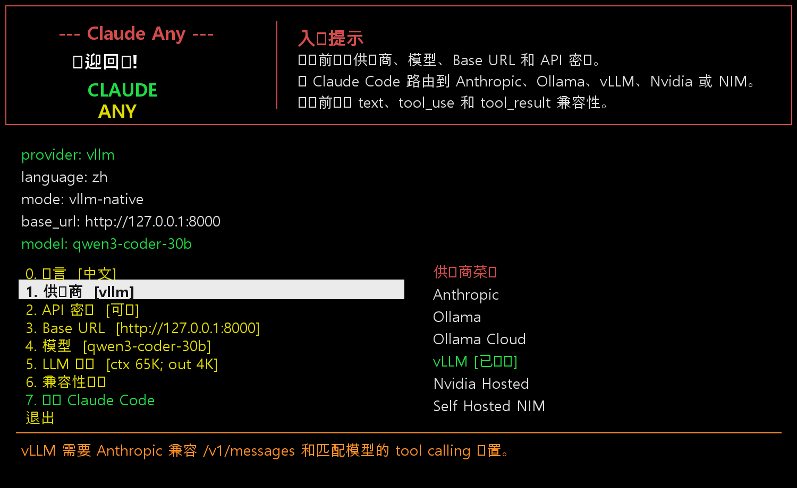
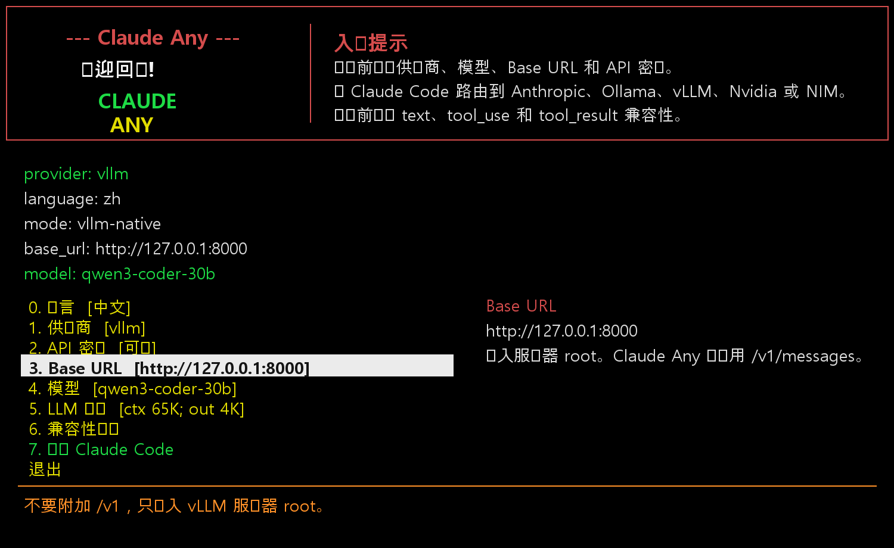
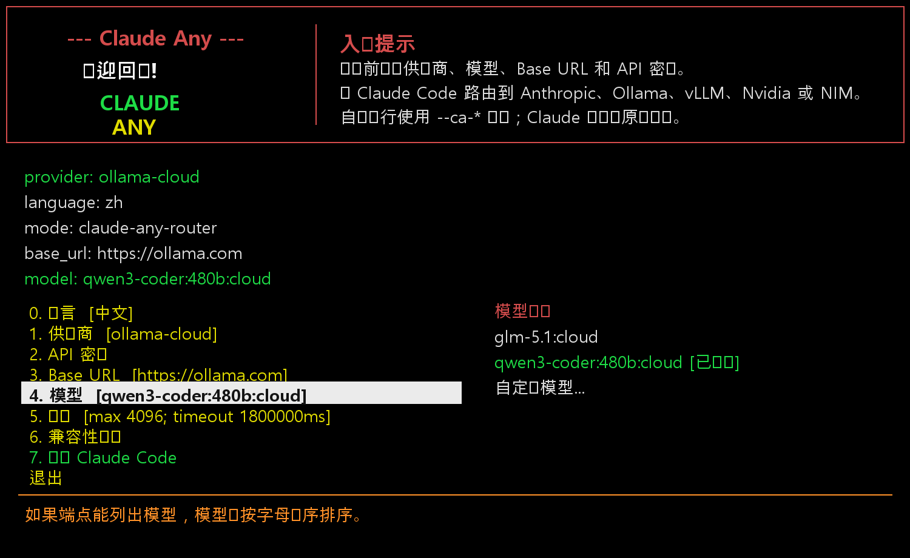
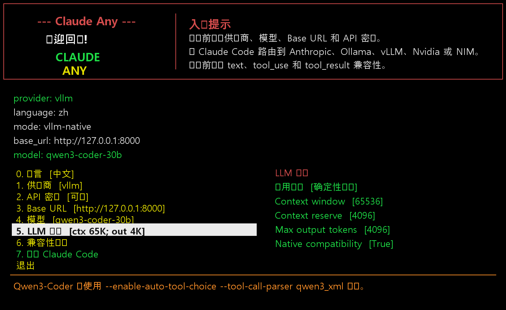
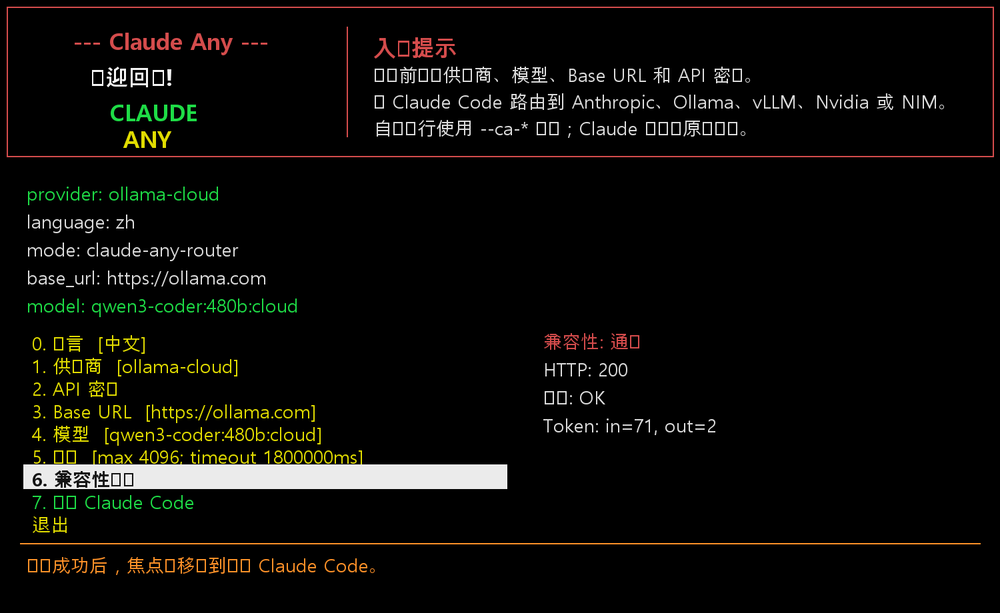

# Claude Any


| [English](../README.md) | [한국어](README.ko.md) | [日本語](README.ja.md) | 中文 |
| --- | --- | --- | --- |

[](https://www.npmjs.com/package/@oneciel-ai/claude-any)
[](https://www.npmjs.com/package/@oneciel-ai/claude-any)
[](../LICENSE)

> ## 🚀 用免费/低成本 LLM 获取完整的 Claude Code 体验
>
> - **免费** — [NVIDIA hosted NIM](https://build.nvidia.com/)（qwen3-coder-480b、gpt-oss 等），通过 API Catalog 使用。
> - **低成本** — [Ollama Cloud](https://ollama.com/cloud) 提供 GLM、Qwen、DeepSeek 等开源权重模型，价格远低于前沿模型。
> - **免费 + 本地** — 在自己的 GPU 上使用 [Ollama](https://ollama.com/) 或 [vLLM](https://github.com/vllm-project/vllm)，完全离线。
> - **支持 Plan Mode + Advisor** — 在 non-Anthropic provider 上保留 Claude Code Plan Mode，并可使用长上下文 Advisor 模型进行工作审查。
> - **平滑使用免费模型 RPM** — Claude Code 会花时间读取文件和执行 tool，Claude Any 会利用这些自然间隔进行 RPM pacing，让 NVIDIA hosted 免费模型在严格的每分钟限制下也更容易使用。
>
> 在 Claude Code 启动**之前**，通过控制台菜单选择 provider、模型、Base URL、API 密钥、流式行为以及 LLM 选项。Claude Code 本体保持原样运行 —— 所有原生工具、slash 命令和工作流都不受影响。

## 今日新增的 3 个最大收益

1. **non-Anthropic 模型也能使用 Plan Mode** — NVIDIA hosted、Ollama Cloud、本地 Ollama、vLLM、NIM 等 provider 也可以保留 Claude Code Plan Mode。
2. **用更大的模型做 Advisor 审查** — 启动时选择长上下文 Advisor Model，然后在 Claude Code 中使用 `/advisor` 检查当前任务、blocker 和下一步具体行动。
3. **免费模型 RPM 限制更平滑** — router-side RPM pacing 会利用文件读取和 tool 执行的自然耗时，让 NVIDIA hosted 免费模型在每分钟限制内运行时更少感到等待。

### 演示


NVIDIA hosted NIM（deepseek-4-flash）通过 claude-any 路由器驱动 Claude Code。 &nbsp;[完整 mp4 ⤓](https://github.com/OneCielAI/claude-any/raw/main/demo/claude-any-nvidia-nim.mp4)


Ollama Cloud（glm-5.1）在启用 SSE 单词边界分块的情况下通过 claude-any 路由器流式传输。 &nbsp;[完整 mp4 ⤓](https://github.com/OneCielAI/claude-any/raw/main/demo/claude-any-ollama-cloud.mp4)

---

Claude Any 是 Claude Code 的启动前供应商选择器。它可以在 Claude Code 启动前
选择 Anthropic、Ollama、Ollama Cloud、vLLM、NVIDIA hosted 或 self-hosted
NIM，并把普通 Claude Code 参数原样传递。

Credits: One Ciel LLC

当前版本: `0.1.28`

## 为什么存在

即使使用 Claude Code 的最高套餐，长时间工作时也可能遇到 token 不足，或者
必须等待下一轮额度才能继续会话。Claude Any 不是为了替代 Claude Code，而是
为了让工作不中断。NVIDIA NIM、Ollama Cloud、vLLM、本地 Ollama 等供应商可
用于摘要、调研、日志、简单编码和后台委派任务。

如果供应商提供 Anthropic 兼容 Messages 端点，Claude Any 会优先使用这条
路径，以尽量保留 Claude Code 的工具、权限、模型选择和工作流体验。远程供应商
无法直接提供的网页搜索能力，则通过独立 MCP 工具补充。

启动前菜单优先考虑控制台和 SSH 工作流。Claude Code 启动前，可以方便地查看
和修改供应商、模型、Base URL、API 密钥和选项。

macOS 尚未充分测试，但项目主要基于 portable Python 和 shell wrapper。如遇
问题请反馈。

- D. Yun

## 安装

[](https://www.npmjs.com/package/@oneciel-ai/claude-any)
[](https://www.npmjs.com/package/@oneciel-ai/claude-any)

要求:

- Python 3.10+
- 已安装 Claude Code，并可通过 `claude` 命令运行
- Node/npm（用于安装 shim 和可选的 MCP 网页工具）

**从 npm registry 安装（推荐）:**

```sh
npm install -g @oneciel-ai/claude-any
```

```sh
claude-any
```

**升级:**

```sh
npm update -g @oneciel-ai/claude-any
```

```sh
claude-any version
```

**卸载:**

```sh
npm uninstall -g @oneciel-ai/claude-any
```

### 其它安装方式

直接从 GitHub 仓库安装（在两次 publish 之间测试未发布的提交时有用）:

```sh
npm install -g https://github.com/OneCielAI/claude-any.git
```

```sh
claude-any
```

POSIX 源码安装:

```sh
git clone https://github.com/OneCielAI/claude-any.git
```

```sh
cd claude-any
```

```sh
./install.sh
```

```sh
claude-any
```

Windows PowerShell 源码安装:

```powershell
git clone https://github.com/OneCielAI/claude-any.git
```

```powershell
cd claude-any
```

```powershell
.\install.ps1
```

```powershell
claude-any
```

### 发布（维护者）

发布新 GitHub Release 时，
[`Publish to npm`](../.github/workflows/npm-publish.yml) 工作流会自动
将包发布到 npm 。该工作流读取仓库 secret `NPM_TOKEN`，token 需要对
`@oneciel-ai/claude-any` 拥有写权限并启用 *Bypass 2FA for publishing*。

发布流程:

1. 升级 `package.json` 的 `version` 和 `claude_any.py` 的 `VERSION`。
2. 增加 Changelog 条目。
3. `git tag -a vX.Y.Z -m "..." && git push origin vX.Y.Z`。
4. `gh release create vX.Y.Z --title "..." --notes "..."` —— 触发 publish 工作流。


## 演示



当前演示展示供应商选择、Base URL、模型选择、LLM 选项和兼容性测试。兼容性
测试不仅检查普通文本响应，还会检查必需的 `tool_use` 和 `tool_result` 往返。

| 供应商 | Base URL | 模型 | LLM 选项 | 兼容性 |
| --- | --- | --- | --- | --- |
|  |  |  |  |  |

详细设置、headless 参数和故障排查请看 [manual](manual.md)。演示视频位于
[assets/claude-any-demo.zh.mp4](assets/claude-any-demo.zh.mp4)。

## 开发故事

Claude Any 是通过一系列实际集成测试构建出来的：先尝试供应商切换，然后验证
模型发现、API 密钥输入、兼容性测试、网页搜索工具、超时处理，以及 Claude
Code 的原生行为。最有用的结论是：当供应商提供 Anthropic 兼容 Messages 端点时，
这是最干净的集成路径。Ollama、vLLM 和 NIM 都可以提供 Anthropic 兼容路由，
这种路径比通用 OpenAI 兼容 chat 路由更能保留 Claude Code 的工具模型。

本地 Ollama 和 vLLM 也在 RTX 5090 与 MSI GB10 级硬件上测试过 Qwen 3.6 27B
Q4。它可以运行，但速度不应直接与 native Claude Code 或 Codex 比较。对于这类
混合后台工作，NVIDIA NIM 和 Ollama Cloud 的一些 hosted/cloud 模型反而比预期
更实用。

OpenAI 兼容端点被有意排除在 Claude Code 的主要路径之外。在测试中，通过
generic OpenAI chat 兼容层进行 tool-call 转换时，在 tool parameter、tool
result、重复调用、retry 和模型选择附近表现得更脆弱。因此 Claude Any 优先
使用 native Anthropic 兼容 endpoint，只在需要 provider-specific 适配时使用
一个小型 router。

最近的 vLLM 测试说明，服务器端 tool-call parser 必须和模型系列匹配。即使
vLLM 服务器可连接、`/v1/messages` 可用，只要 `--tool-call-parser` 不匹配，
Claude Code 也可能无法解析 tool call 并停止。Qwen3-Coder 系列优先使用
`--enable-auto-tool-choice --tool-call-parser qwen3_xml`；`hermes` 更适合
Hermes 格式模型或部分较旧的 Qwen tool template。

## 推荐用途

适合速度不是主要瓶颈的后台运维任务，例如 Docker 主机维护、Windows/Linux
管理、清理脚本、定期安全检查、日志审查、Windows Event Log 审查、病毒或
勒索软件入侵尝试整理、暴力登录尝试审查和报告草稿生成。

它不能替代专业安全产品，但可以帮助管理员把重复检查变成脚本和可读报告。用
这种方式可以构建免费或低成本的系统安全看护助手。

例如，可以把“在 Docker 容器中安装 PostgreSQL”或“分析今天的 Docker 日志并
通过邮件发送报告”这样的请求转成具体命令、脚本、计划任务和摘要。

一种实用模式是分层监督：小模型负责检测和摘要，大模型负责审核、策略和计划，
然后小模型在大模型监督下执行重复任务。

## 主要功能

- 英语、韩语、日语、中文 UI 的启动前菜单。
- 按供应商列出模型，并支持自定义模型输入。
- 在 Claude Code 聊天输入之外设置 API 密钥。
- LLM 选项/预设，可配置 context window、output tokens、timeout、sampling 和 native compatibility。
- 启动前文本、`tool_use`、`tool_result` 兼容性测试。
- 当 vLLM/NIM 的 `/v1/models` 返回 `max_model_len` 时显示运行时上下文。
- 面向 SSH 和终端的控制台优先 UI。
- 有 Anthropic 兼容端点时优先使用 native 路径。
- 必要时使用 provider-specific router。
- 为 non-native provider 连接 DuckDuckGo/fetch MCP。
- 支持 `--ca-provider`、`--ca-model`、`--ca-base-url` 等 headless 参数。
- 在 router-backed non-Anthropic provider 上支持 Claude Code Plan Mode，
  包括本地处理 `EnterPlanMode` 和 plan artifact 流程。
- 可选 `/advisor` slash command，可把当前任务状态发送给选定的 Advisor Model，
  适合长上下文审查和下一步检查。
- 集成 Claude Code `statusLine`，在底部状态区域显示 router RPM 使用量和等待时间，
  不再污染聊天正文。
- 针对 NVIDIA hosted、self-hosted NIM、Ollama、Ollama Cloud 的 router-side RPM 控制。
  `rate_limit_rpm=0` 会关闭 throttling，但仍显示最近 60 秒使用量。
- soft pacing 会扣除已经花在文件读取、命令执行和等待 tool 结果上的时间。在真实
  编码会话中，这些 tool-call 间隔会自然吸收很多 RPM 间隔，因此可以在 NVIDIA
  hosted NIM 等免费模型的 RPM 限制内运行，同时不会让每个 Claude Code turn 都
  明显感觉到 rate limit。
- Ollama/Ollama Cloud 路由路径的流式代理 — token 到达后立即转发给 Claude Code，
  不再等待完整响应。
- 按 provider 的 `stream` on/off 开关和 `stream_word_chunking` 选项，可将文本
  delta 合并到单词边界后再发送，缓解长流式响应中 SSE 分片导致的 tool-call /
  JSON 解析错误。
- LLM options 菜单会在面板底部以当前语言（英语/韩语/日语/中文）显示高亮行的
  含义；布尔行（`Stream`、`Stream word chunking`、`Native compatibility`、
  `Think`）按 Enter 即可就地切换。
- Tool guard hook 覆盖范围扩展到 Claude Code 的全部 hook event（包含
  `WorktreeCreate` / `WorktreeRemove`），解决非 git 工作目录下 Agent isolation
  因 `Cannot create agent worktree: not in a git repository...` 而失败的问题。
- 配置文件缓存 — 路由器将设置缓存到内存，仅在文件修改时重新读取，
  减少了每次请求的磁盘 I/O 开销。

## 更新日志

### 0.1.28

- **Plan Mode + Advisor 标题**: 文档现在强调 router-backed non-Anthropic
  provider 的 Plan Mode 支持，以及由选定长上下文 Advisor Model 驱动的 `/advisor`
  slash command。
- **statusLine RPM 显示**: Claude Any 会安装 Claude Code `statusLine` command，
  在底部状态区域显示 router RPM 使用量和最近等待时间，避免 rate-limit 信息污染聊天正文。
- **面向免费 hosted 模型的 soft RPM pacing**: NVIDIA hosted、self-hosted NIM、
  Ollama、Ollama Cloud 都可使用 router-side RPM pacing。它会扣除已经花在文件读取、
  命令执行和等待 tool 结果上的时间，因此真实编码中的 tool-call 间隔会自然吸收 RPM 间隔。
- **无限制时的使用量显示**: `rate_limit_rpm=0` 会关闭 throttling，但仍显示最近
  60 秒的请求使用量。

### 0.1.27

- **支持 non-Anthropic provider 的 Plan mode**: 路由器会保留 `EnterPlanMode`，即使上游模型不能稳定选择 Claude Code 内部 Plan tool，也能让 Claude Code 进入 Plan mode。对于强制 `tool_choice=EnterPlanMode` 的请求，路由器会在本地返回有效的 Anthropic `tool_use`。当较长的实现请求只得到很短或空的、不可执行的文本响应时，路由器会通过不依赖语言的结构检查将其提升为 `EnterPlanMode`。
- **Plan-mode self-tool 处理**: 不支持的 Claude Code self-tool 在 non-Anthropic provider 下仍会被移除，但 Plan-mode tool 会单独处理，不再禁用 planning 能力。

### 0.1.25

- **Plan mode 诊断**: 将 `TRACE` 写入 `~/.config/claude-any/log-level` 后，会在 `requests.jsonl` / `responses.jsonl` 中记录请求/响应摘要。
- **Headless agent chat**: 路由器提供 `/ca/chat/messages`、`/ca/chat/wait`、`/ca/chat/stream`。子 coding agent 可以按最后看到的 message id 拉取更新，也可以通过 SSE 等待回复。
- **Plan artifact 服务**: 可通过 `/ca/plan/artifacts` 创建 plan 文件并以本地 URL 分享。这里没有复制 Anthropic 的内部实现，只独立实现了文件/artifact 型工作流。

### 0.1.24

- **首次正式发布到 npm registry**: 在正确的 scope `@oneciel-ai/claude-any` 下发布。此前的 0.1.x 版本从未上传到 registry，从该版本起可以直接通过 `npm install -g @oneciel-ai/claude-any` 安装。

### 0.1.23

- **流式开关**: 每个 non-Anthropic provider 新增 `stream_enabled` 开关（在 LLM
  options 菜单、`claude-anyctl ollama-options` / `provider-options`、以及 headless
  参数中都可用）。关闭后路由器会对上游强制 `stream:false`，把完整响应一次性
  返回给 Claude Code — 这是流式分片破坏 tool-call/JSON 解析时的回避方案。
- **单词边界流式**: 新增 `stream_word_chunking` 选项。将 SSE 文本 delta 在
  空白/单词边界处合并后再发送。Ollama 路由路径和 native 透传路径（vLLM、NVIDIA
  hosted、self-hosted NIM）都已实现。工具 delta 和非文本 SSE 事件原样透传。
- **完整 hook 处理**: `install_tool_guard_hooks` 现在会注册 Claude Code 的全部
  hook event（PreToolUse、PostToolUse、PostToolUseFailure、PostToolBatch、
  PermissionRequest、PermissionDenied、SessionStart/End、Setup、UserPromptSubmit/
  Expansion、Stop、StopFailure、InstructionsLoaded、ConfigChange、CwdChanged、
  Notification、SubagentStart/Stop、TeammateIdle、TaskCreated、TaskCompleted、
  PreCompact、PostCompact、WorktreeCreate、WorktreeRemove、Elicitation、
  ElicitationResult）。WorktreeCreate 处理器返回 `worktreePath = base_path`，
  因此非 git 目录中 Agent isolation 也能正常工作。
- **Windows hook 兼容性**: `shell_command_string` 现在在 Windows 上输出正斜杠和
  POSIX 引用，避免 Claude Code 的 sh hook 执行器把 `C:\Users\...` 中的反斜杠
  当作转义字符吞掉。
- **LLM options UX**: 在面板底部以用户语言显示高亮行的解释。布尔切换
  （`Stream`、`Stream word chunking`、`Native compatibility`、`Think`）按 Enter
  原地切换 — 无需输入提示。

### 0.1.22

- **Headless 手册扩展**: 增加面向自动化和远程服务器的 headless setup / launch / test / passthrough / cleanup 实用示例。

### 0.1.21

- **服务生命周期文档**: 明确说明 Claude Any 会在启动时只启动当前 provider 所需的 router/proxy，`claude-any stop` 是显式清理命令。

### 0.1.20

- **NVIDIA hosted quick test**: `auto` 模式现在对 NVIDIA hosted provider 使用 text-only quick test，避免菜单检查中较慢或不稳定的 tool_use 请求。text + tool_use 使用 `smoke`，完整 text/tool_use/tool_result round trip 使用 `full`。
- **菜单测试超时**: 终端菜单现在运行 `claude-any test 60 auto`，让 hosted model 的 pre-launch test 更快结束。

### 0.1.19

- **更快的兼容性测试**: `claude-any test` 现在支持 `auto`、`smoke`、`full` 模式。
- **菜单默认测试提速**: 终端菜单现在运行 `claude-any test 120 auto`。NVIDIA hosted 兼容性检查会更快，完整验证仍可通过 `claude-any test 180 full` 使用。

### 0.1.18

- **NVIDIA hosted 临时故障诊断**: 兼容性测试现在会将 `RemoteDisconnected`、connection reset、502/503/504 响应标记为 NVIDIA hosted backend/API Catalog 的临时 upstream 故障。
- **NVIDIA proxy 清理改进**: `claude-any stop` 现在也会匹配 `nvd-claude-proxy` 可执行进程，从而更可靠地清理 stale proxy session。

### 0.1.17

- **菜单兼容性测试超时**: 终端菜单现在以明确的 180 秒限制运行兼容性测试，并在超过 hard limit 时停止子进程，避免较慢的 hosted model 让菜单看起来无限等待。

### 0.1.16

- **NVIDIA hosted proxy 启动修复**: 在 fallback 到 `python -m nvd_claude_proxy.main` 之前，先检测并启动已安装的 `nvd-claude-proxy`/`ncp` 可执行文件。支持 proxy 通过 uv tool 安装、命令可用但无法从 Claude Any 的 Python 解释器 import 的环境。

### 0.1.15

- **Ollama/Ollama Cloud 工具调用流式修复**: 流式工具调用现在使用连续的 Anthropic SSE content block index 和 `input_json_delta` payload 输出，避免 Claude Code 将 malformed streamed tool-use block 拒绝为 `Invalid tool parameters`。
- **Tool guard 自动安装**: 非 Anthropic provider 启动时会将 Claude Any tool guard 合并到 `~/.claude/settings.json`，在执行前规范化生成的工具输入。
- **工具调用诊断日志**: 路由器侧工具调用记录到 `~/.config/claude-any/tool-calls.jsonl`，Claude Code hook 输入记录到 `~/.claude/claude-any-tool-guard/tool-events.jsonl`。
- **工具输入规范化**: guard 会将 `path` 映射为 `file_path`、`cmd` 映射为 `command`、`query` 映射为 `pattern`，并在缺少必填字段时返回明确提示。

### 0.1.14

- **SSH/终端方向键兼容性**: 重写 `read_menu_key()`，加入 ANSI escape sequence 解析器，并将 raw 终端设置移至 `portable_select()`，使菜单循环期间终端始终维持 raw 模式。解决按键间隙 `ECHO` 恢复导致转义序列泄漏到屏幕的问题。方向键、Home、End 键现可在 SSH 会话中稳定工作。
- **测试超时**: 将兼容性测试默认超时从 60 秒延长至 120 秒，以适配较慢的云供应商。
- **Ollama Cloud 兼容性测试修复**: 在兼容性测试请求中添加 `"stream": false`，使路由器向 Ollama Cloud 请求单个 JSON 响应而非 SSE 流式传输，从而解决 `post_json` 在收集所有 SSE 分片时超时的问题。

### 0.1.13

- **Ollama 流式代理**: 路由器现在以 Anthropic SSE 格式实时流式传输 Ollama/Ollama Cloud 响应，替代了之前缓冲完整响应再转发的方式。
- **配置缓存**: `load_config()` 将配置文件缓存到内存，仅在文件修改时间变化时重新读取。消除了路由器每个请求中重复的磁盘读取和 JSON 解析。
- **Token 估算缓存**: `estimate_tokens()` 接受可选的缓存字典，避免单个请求中的冗余 `json.dumps()` 调用。`ollama_chat_request` 和 `cap_output_tokens_for_context` 共享同一缓存。

### 0.1.12

- 刷新文档和演示素材。

### 0.1.11

- 验证工具调用兼容性。

### 0.1.10

- 在测试中显示运行时上下文。

### 0.1.9

- 将预设上限限制到服务器上下文。

### 0.1.8

- 本地化 LLM 预设。

## 供应商说明

| Provider | Mode | Notes |
| --- | --- | --- |
| Anthropic | Native Claude Code | 使用 Claude 登录或 Anthropic API key。 |
| Ollama | Native 优先，必要时 router | 本地 Ollama 通常不需要 API key；通过本地 Ollama 使用 `:cloud` 模型时，需要在 Ollama host 上 `ollama signin`。 |
| Ollama Cloud | Router | 直接调用 `https://ollama.com/api`，需要 Ollama API key。 |
| vLLM | Native Anthropic-compatible endpoint | 使用 Anthropic 兼容 `/v1/messages` endpoint，并让 `--tool-call-parser` 匹配模型系列。 |
| NVIDIA hosted | Router/proxy | 通过 compatibility 路径使用 NVIDIA hosted API。 |
| self-hosted NIM | Native Anthropic-compatible endpoint | 使用 self-hosted NIM 的 Anthropic 兼容 endpoint。 |

## 服务生命周期

Claude Any 不会一直运行所有可能的 backend helper。正常生命周期如下：

- 启动前，可用 `claude-any stop` 清理受管理的 router/proxy 进程。
- `claude-any` 启动 Claude Code 时，只启动当前所选 provider 需要的服务。
- Ollama/Ollama Cloud router mode 使用 `127.0.0.1:8799` 上的 Claude Any router。
- NVIDIA hosted router mode 使用 `127.0.0.1:8799` 上的 Claude Any router，并且只在
  该 provider 需要时启动 `127.0.0.1:8788` 上的 `nvd-claude-proxy`。
- 从 NVIDIA hosted 切换到其他 provider 时，不需要让 NVIDIA proxy 一直运行。新的
  test 或 launch 之前，请用 `claude-any stop` 清理 stale session。

这样 Claude Code 可以始终使用稳定的 Claude Any 入口，同时 provider-specific helper
只在需要时启动。

## Headless Agent Chat

路由器运行时，子 agent 可以不打开菜单，直接通过本地 HTTP 协作。

```sh
curl -s http://127.0.0.1:8799/ca/chat/messages \
  -H 'content-type: application/json' \
  -d '{"channel":"agents","sender_id":"codex","recipients":["kimi"],"message":"需要失败测试日志。"}'

curl -s 'http://127.0.0.1:8799/ca/chat/messages?channel=agents&recipient=kimi&after=0'

curl -N 'http://127.0.0.1:8799/ca/chat/stream?channel=agents&recipient=codex&after=10&timeout=300'

curl -s http://127.0.0.1:8799/ca/plan/artifacts \
  -H 'content-type: application/json' \
  -d '{"title":"handoff","name":"handoff.md","content":"# Plan\n- reproduce\n- patch\n- verify"}'
```

消息保存在 `~/.config/claude-any/chat-messages.jsonl`，plan 文件保存在
`~/.config/claude-any/plan-artifacts/`。

为 Claude Code 启动 Qwen3-Coder vLLM 的示例:

```sh
vllm serve Qwen/Qwen3-Coder-30B-A3B-Instruct \
  --host 0.0.0.0 \
  --port 8000 \
  --served-model-name qwen3-coder-30b \
  --max-model-len 65536 \
  --enable-auto-tool-choice \
  --tool-call-parser qwen3_xml
```

链接:

- vLLM Claude Code integration: https://docs.vllm.ai/en/latest/serving/integrations/claude_code/
- vLLM tool calling: https://docs.vllm.ai/en/stable/features/tool_calling/

## 许可证

MIT。请参阅 [LICENSE](../LICENSE)。
